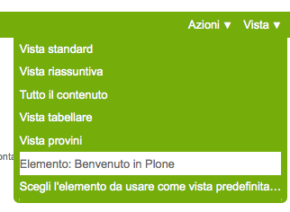
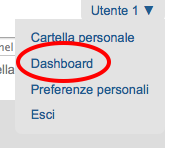
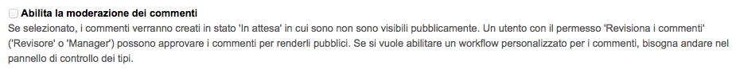

.. _chapter-appendix-a:

==============================
Appendice A - tutti i permessi
==============================

In questo capitolo verranno descritti *tutti* i permessi Plone che sono utilizzati dal CMS e che
può valere la pena conoscere per modificarne i comportamenti.

Verranno anche analizzati alcuni permessi che erano utilizzati in versioni precedenti del CMS e che
oggi sembrano aver perso prestigio, ma che può valere la pena conoscere in presenza di vecchi
prodotti.

.. _section-permissions-old-topic:

ATContentTypes Topic: Add *...Criterion*
========================================

Questa grande serie di permessi è storicamente collegata alle **vecchie collezioni**, ancora
presenti in Plone ma disabilitate e sostituite con una nuova versione a partire da Plone 4.2. 

Se vi ritrovate a gestire versioni di Plone più vecchie di questa o se siete di fronte ad un sito
Plone migrato da una vecchia versione (le vecchie collezioni non vengono trasformate nelle nuove
versioni nel processo di migrazione) vale la pena continuare la lettura.

Questi permessi controllavano il potere di un utente di poter usare uno specifico criterio.
Per fortuna ora non serve più occuparsene.

Per impostazione predefinita: solo *Manager* e *Amministratore del sito* posseggono questi
permessi.

Add portal member
=================

E' il permesso che controlla il potere di creare nuovi utenti nel sito.

Oltre al *Manager* e all'*Amministratore del sito* se viene aggiunto anche il ruolo *Anonimo* si
abilita la libertà dei visitatori di iscriversi al sito.

Oggi è raramente manipolato manualmente poiché è stato aggiunto un controllo specifico nella
sezione "*Sicurezza*" della configurazione del sito.

.. figure:: _static/site-security-free-registration.png
   :alt: Il controllo per abilitare l'autoregistrazione

   *Il controllo nella gestione della "Sicurezza" del sito, che permette di abilitare
   l'auto-registrazione degli utenti*

.. _section-permissions-add-portal-topic:

Add portal topics
=================

E' il permesso che determina il potere di aggiungere le vecchie **Collezioni** nel sito Plone
(*Topic* è stato il primo nome del tipo di contenuto, poi diventato *Cercatore* ed infine ha
preso il nome odierno).

Vale quanto detto per gli altri
:ref:`permessi di aggiungibilità dei contenuti <section-permissions-atct-add-all>` Plone, ma i
ruoli che lo posseggono sono solo i seguenti *Manager* e *Amministratore del sito*.

Ignorate questo permesso se non dovete gestire le vecchie collezioni, poiché il permesso usato ora
è ":ref:`section-permissions-plone-app-collection-add`".

.. _section-permissions-allow-sento:

Allow sendto
============

E' il permesso che permette di utilizzare una vista che permette di inviare un collegamento al
documento corrente per e-mail.

Il link a questa pagina è stato disabilitato di default nelle recenti versioni di Plone (in realtà
non è una funzionalità così utile e probabilmente il link così esposto era facile preda di crawler
malevoli).

E' ancora utilizzabile conoscendone l'URL (inserendo ``/sendto_form`` dopo l'URL di un documento)
o riabilitando il link dal ``portal_actions`` in ZMI.

Il permesso è dato al ruolo *Anonimo*, quindi chiunque può utilizzare questo form. 

Change portal topics
====================

Questo permesso è storicamente associato al permesso di modifica delle *Collezioni*.

Se le *Collezioni* che state gestendo sono quelle introdotte con Plone 4.2, questo stesso permesso
è diventato inutile, poiché ora il permesso di riferimento è *Modify portal content*, come per
tutti gli altri tipi.

Questo permesso vale ancora la pena essere gestito se avete a che fare con le vecchie collezioni.
Vedere quanto detto per i
:ref:`vecchi permessi di gestione dei criteri <section-permissions-old-topic>`.

* *Manager*
* *Amministratore del sito*
* *Possessore*

.. _section-permissions-content-rules-manage-rules:

Content rules: Manage rules
===========================

Questo permesso è legato alla possibilità di poter gestire le **regole** di Plone sulla cartella
corrente.

Per impostazione predefinita: solo *Manager* e *Amministratore del sito* posseggono questi
permessi.

.. _section-permissions-copy-or-move:

Copy or Move 
============

Questo permesso è legato alle operazioni di **copia** e **taglia**.

Non è nei fatti un permesso molto importante; per impostazione predefinita è infatti dato gli
*Anonimi* quindi a chiunque.
Il motivo è perché il vero "lavoro" viene fatto con l'operazione di *incolla*, che non è gestito
da questo permesso.

Vale la pena gestire questo permesso (magari in un workflow specifico) se per qualche motivo volete
rendere impossibile la copia o lo spostamento di un documento.
In questi casi il fatto che il permesso sia unificato per copia e taglia a volte crea problemi.

List portal members
===================

E' il permesso che controlla la possibilità di accedere alla lista degli utenti del sito.

Per impostazione predefinita questo permesso è dato ai *Manager*, all'*Amministratore del sito* e
al *Collaboratore* (quindi in pratica tutti gli utenti del sito possono vedere gli altri).

Vale la pena modificarlo in presenza di stringenti motivi di privacy.

.. _section-permissions-mail-forgotten-password:

Mail forgotten password
=======================

Anche se letteralmente la traduzione del permesso è *invio della password per e-mail* (in ricordo
dei tempi in cui Plone memorizzata le password in chiaro e le inviata agli utenti), oggi questo
permesso controlla il potere di ricevere il link per eseguire il reset della password in caso si
sia dimenticata.

Se volete disabilitare la funzionalità (magari perché le password non sono gestire in Plone ma in
un LDAP esterno) vale la pena togliere questo permesso a chiunque.

E' ovviamente dato agli utenti *Anonimi*.

.. _section-permissions-manage-groups:

Manage Groups
=============

Era il permesso generale per poter gestire i gruppi di Plone.
 
Il permesso è in gran parte inutilizzato (alcune verifiche di questo sono ancora esistenti in
vecchi template di gestione gruppi e utenti, ora deprecati e che verranno rimossi con Plone 4.3.

Manage users 
============

Vedere quanto detto per ":ref:`section-permissions-manage-groups`".

Modify view template
====================

Questo permesso controlla la comparsa del menù "*Vista*" e le funzionalità di poter scegliere una
vista per una cartella e un documento come vista predefinita.

C'è un solo permesso per entrambe le funzionalità, non è possibile quindi differenziare i
comportamenti.

   *Come si presenta il menù vista*

Per impostazione predefinita i seguenti ruoli posseggono questo permesso:

* *Manager*
* *Amministratore del sito*
* *Possessore*
* *Editor*

.. _section-permissions-plone-site-setup-all:

Plone Site Setup: *...*
=======================

Senza bisogno di scendere in ulteriori dettagli, Plone offre una serie di permessi che servono a
gestire in modo puntuale le voci nella *configurazione del sito*.

Per ogni pannello di configurazione c'è un permesso con prefisso "*Plone Site Setup:*".

Mettiamo solo in una minima evidenza due permessi in particolare:

**Plone Site Setup: Overview**
    E' il permesso principale, per accedere al pannello di controllo generale.
**Plone Site Setup: Users and Groups**
    Questo permesso serve ad accedere alla sezione di gestione gruppi e utenti e pare quindi aver
    sostituito i vecchi permessi "*Manage groups*" e "*Manage users*".
    
    **Questo permesso permette davvero di gestire utenti e gruppi** se assegnato ad altri ruoli
    (purtroppo, ancora una volta, non è possibile limitarsi ad uno dei due poteri).

Per impostazione predefinita i seguenti ruoli posseggono questo permesso:

* *Manager*
* *Amministratore del sito*

E' possibile quindi facilmente escludere uno dei pannelli di configurazione di Plone a qualunque
modifica, togliendo il permesso associato.

.. _section-permissions-portlets-manage-own-portlets:

Portlets: Manage own portlets
=============================

E' il permesso per gestire le proprie portlet (nella dashboard) e controlla quella voce di menù.

Per impostazione predefinita i seguenti ruoli posseggono questo permesso:

* *Manager*
* *Amministratore del sito*
* *Collaboratore*

.. _section-permissions-portlets-view-dashboard:

Portlets: View dashboard
========================

Permesso per poter vedere la propria **dashboard**.

   *Link alla Dashboard dal menù personale*

Rimuovendo questo permesso però il link dal menù personale alla *dashboard* non viene rimosso, ma
si ottiene un errore per permessi insufficienti una cliccato (è come se ci fosse la possibilità di
vedere la propria dashboard senza poterla modificare, ma al momento la cosa non funziona a dovere).

Per impostazione predefinita i seguenti ruoli posseggono questo permesso:

* *Manager*
* *Amministratore del sito*
* *Collaboratore*

In pratica: a tutti gli utenti del sito.

.. _section-permissions-set-own-password:

Set own password
================

E' il permesso associato alla funzionalità di poter cambiare la propria password dalla vista
"*Azzera la password*", accessibile tramite le proprie preferenze personali.

E' differente dal permesso ":ref:`section-permissions-mail-forgotten-password`" perché in questo
caso l'utente è autenticato nel sistema.
Anche in questo caso però potreste voler togliere questo permesso in casi di fonti dati utente
esterne (quali LDAP).

Il permesso è dato a tutti gli utenti *Autenticati*

Set own properties
==================

E' il permesso legato al potere dell'utente di modificare le proprie informazioni personali.

Togliendo questo permesso (assegnato a tutti gli *Autenticati*) l'utente non è più in grado di
accedere alla voce "*Preferenze personali*" nel proprio menù di autenticazione.

Purtroppo non è la voce in se a sparire ma si ottiene un errore di permessi insufficienti nel caso
si clicchi sulla voce.

Use mailhost services
=====================

Questo permesso è collegato all'utilizzo del sistema di invio e-mail interno di Plone.

Normalmente l'unico punto di contatto tra gli utenti del sito e le e-mail inviate dal sito si hanno
per l'invio del resert della password (":ref:`section-permissions-set-own-password`") e per l'invio
di un link alla pagina corrente (":ref:`section-permissions-allow-sento`").
In entrambi i casi Plone verifica due permessi specifici.

Se però un prodotto aggiuntivo, o una vostra funzionalità specifica, dovessere tentare di invare un
messaggio e-mail, questo permesso verrebbe verificato, quindi in questi casi vale la pena
verificarne le impostazioni.

Per impostazione predefinita i seguenti ruoli posseggono questo permesso:

* *Manager*
* *Amministratore del sito*

View Groups
===========

E' un permesso collegato a vari metodi di basso livello per accedere ai gruppi

E' assegnato ai *Manager*, *Amministratori del sito* e *Collaboratori*, quindi a tutti gli utenti
autenticati.

Da test eseguiti, se si rimuove il permesso per il *Collaboratore*, gli utenti sono comunque in
grado di accedere alla pagina di *Condivisione* e ricercare gruppi. 

View management screens
=======================

Vale la pena dire due parole su questo permesso, assegnato solo al *Manager* (e al *Possessore*, ma
il proprietario del "sito" è sempre un Manager) ma non all'*Amministratore del sito*.

Questo permesso permette agli utenti di entrare in ZMI ed è stato uno dei motivi scatenanti per
la creazione del ruolo separato "*Amministratore del sito*".

.. _section-permissions-iterate-all:

iterate : Check *...*
=====================

I due permessi *iterate : Check in content* e *iterate : Check out content* sono forniti dal
prodotto che si occupa del supporto alla *copia di lavoro*.
 
Abbiamo già visto alcuni permessi che si occupano del versionamento e che lavorano con questo
prodotto (vedere i :ref:`permessi relativi a CMFEditions <section-permissions-cmfeditions-set>`).

Questi due permessi sono definiti, ma sembrano non usati da nessun componente Plone.

Reply to item
=============

Questo permesso identifica il potere di poter **commentare**.

Il Plone i commenti sono ora controllati dal prodotto `plone.app.discussion`__ e possono anche
essere sottoposti a workflow.

__ http://pypi.python.org/pypi/plone.app.discussion

Tenete presente che il permesso controlla i commenti *se i commenti sono abilitati* sul contenuto.

Nella pratica infatti il permesso è dato a tutti gli *Autenticati*, ma di base nessun contenuto
Plone è di per se automaticamente commentabile.

Review comments
---------------

Quando la revisione dei commenti è attivata, chi possiede questo permesso può effettuarne la
revisione.

Questo comportamento viene innanzi tutto abilitato dal pannello di controllo Plone, alla voce
"*Commenti*".

   *L'abilitazione della revisione dei commenti, dal pannello "Impostazioni dei commenti"*

Per impostazione predefinita i seguenti ruoli posseggono questo permesso:

* *Manager*
* *Amministratore del sito*
* *Revisore*

Il motivo per cui esista un permesso separato per la revisione dei commenti (e non venga usato
invece il permesso ":ref:`section-permissions-review-portal-content`" è opinabile.
Sarebbe stato possibile usare quello stesso permesso, applicato al workflow dei commenti.

.. _section-permissions-plone-portlet-collection-add:

plone.portlet.collection: Add collection portlet
------------------------------------------------

Questo permesso è simile al permesso ":ref:`section-permissions-portlets-manage-portlets`", ma è
specifico per poter creare nuove **portlet collezione**.

.. _section-permissions-plone-portlet-static-add:

plone.portlet.static: Add static portlet
----------------------------------------

Questo permesso è simile al permesso ":ref:`section-permissions-portlets-manage-portlets`", ma è
specifico per poter creare nuove **portlet statiche**.

