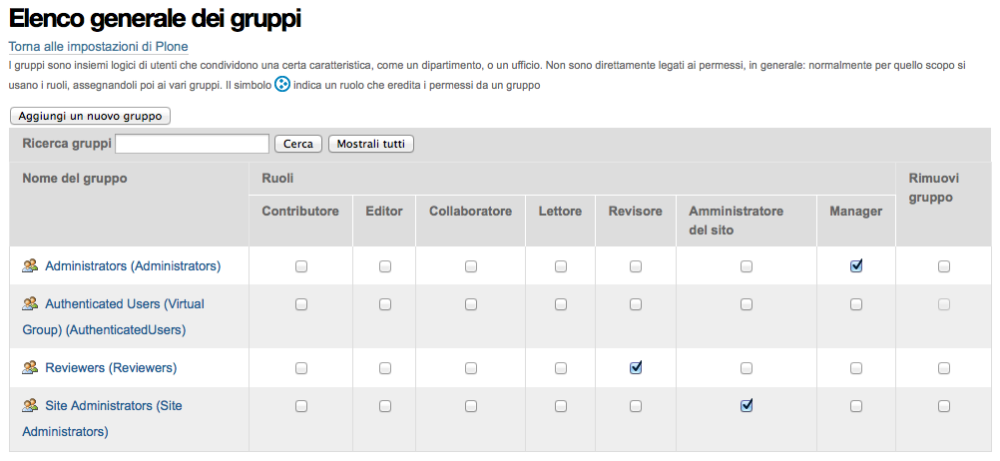

========
I Gruppi
========

I gruppi sono definibili semplicemente come un accorpamento di utenti. A basso livello, nei meandri
del codice, molto spesso gruppi e utenti sono visti allo stesso modo.

I gruppi sono estremamente utili nel momento in cui è necessario assegnare *ruoli locali* qua e là
per il sito.

Solo gli utenti reali possono far parte dei gruppi, l'utente anonimo non è identificabile in nessun
gruppo.

I gruppi predefiniti di Plone
=============================

Alla creazione di un sito Plone troverete già **quattro gruppi predefiniti**, tre di questi hanno
assegnati dei **ruoli globali**, che non ha di solito senso modificare, ma può aver senso eliminare
il gruppo, o evitare di usarlo.

Se uno o più di questi gruppi non serve: cancellatelo! Non ci sono problemi.

   *Come si presenta la gestione dei gruppi*

Il gruppo "Administrators"
--------------------------

Il gruppo degli amministratore è estremamente utile, anche se con la versione 4.1 di Plone e
l'introduzione del nuovo ruolo **Amministratore del sito** (**Site Administrator**) ha forse perso
parte della sua importanza.

Nella configurazione base (e non ho mai trovato motivi per cambiare questo comportamento) il gruppo
possiede nativamente il ruolo di **Manager**, il ruolo più potente di Zope.

Il ruolo di *Manager* non è un ruolo pensato per essere dato localmente a sezioni del sito, quindi
la presenza di questo gruppo e il fatto che il ruolo ad esso assegnato sia un ruolo globale è
una scelta giusta e comoda.

All'interno del gruppo vanno inseriti tutti gli utenti (pochi... o nessuno) che devono avere
questo potere.

Il gruppo "Site Administrators"
-------------------------------

Il gruppo degli amministratori del sito è stato introdotto di recente, con l'introduzione del nuovo
ruolo **Amministratore del sito** (**Site Administrator**).

Le osservazioni fatte per il gruppo *Administrators* si ripetono qui: è un gruppo estremamente
utile e vi vanno inseriti tutti gli utenti del sito che dovranno gestire il sito in futuro.

Il gruppo "Reviewers"
---------------------

Il gruppo dei revisori. Tutti i componenti di questo gruppo hanno il potere di **Revisore**
(**Reviewer**) nel sito.

A differenza degli altri due gruppi descritti precedentemente, l'utilità di questo gruppo non è
assicurata.

Lo consiglio in presenza di piccoli siti, dove la redazione è estremamente limitata ed in effetti
chi revisiona i contenuti lo fa in tutto il sito. In tal caso questo gruppo può servire.

Va però tenuto presente che il ruolo di *Revisore* è assegnato in modo globale, quindi bisogna
anche avere la certezza che non ci siano eccezioni di sorta (nessuna cartella "speciale" dove il
gruppo *non* deve avere questo potere).

In molti altri casi, dove ci sono gruppi separati e redazioni separate, questo gruppo finisce
sempre per rimanere vuoto. A questo punto consiglio di eliminarlo: non ci sono problemi nel farlo e
non otterrete altro che evitare problemi o possibili errori.

Il gruppo virtuale "Authenticated Users"
----------------------------------------

Questo gruppo è un gruppo *virtuale*, non un vero gruppo e non può essere eliminato, poiché
rappresenta tutti gli utenti autenticati nel sito: non appena un utente esegue il login, diventa
parte del gruppo.

.. Note::
   Questa funzionalità è **pericolosa** e va capita fino in fondo

Dare un qualunque potere a questo gruppo (soprattutto nel pannello di controllo dei gruppi, quindi
come *ruolo globale*) significa dare il ruolo a *chiunque* ha un account nel sito.

Il suo uso può invalidare altre configurazioni fatte per altri gruppi o altri utenti.

Un esempio: se assegnassimo un qualunque ruolo al gruppo "*Authenticated Users*", per esempio:
**Lettore** questo renderebbe inutile l'aver assegnato (o assegnare in futuro) quello stesso ruolo
a veri utenti e gruppi.
E' inutile dire "il gruppo dell'Ufficio 5 è *Lettore* sulla cartella
``/uffici/ufficio-5/documenti-privati`` se *tutti* gli utenti del sito hanno quel potere e possono
quindi leggere da quella cartella.
Il rischio è trovarsi in una situazione in cui non si capisce come mai anche i membri del gruppo
"Ufficio 3" possono leggere i documenti riservati in quella sezione.

Perché non lo consiglio?
~~~~~~~~~~~~~~~~~~~~~~~~

Questo gruppo è usato molto spesso a sproposito perché *sembra* facile da capire e usare, più
semplice che comprendere fino in fondo come configurare per bene i workflow di Plone e verificato
lo stato di revisione dei contenuti del sito.

Ne potete di certo fare a meno.

