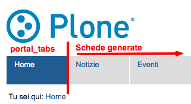

==========
I Permessi
==========

.. only:: not latex

    .. contents:: Indice della sezione

Al capitolo precedente è stata data la definizione di ruolo e si è visto come questo sia associato
direttamente con i **permessi**.
Si è anzi detto come *il ruolo non sia altro che un raggruppamento di permessi*.

Se un utente con ruolo di *Editor* può fare alcune delle cose possibili anche al *Revisore*
(accedere alla vista dei contenuti di una cartella, modificare un documento, ...) è dovuto al fatto
che condividono uno o più permessi.

I permessi sono il vero cuore della sicurezza di Plone, poiché controllano una singola azione o un
comportamento puntuale del CMS.

E' bene chiarire che agiscono a basso livello; fin'ora ci siamo abituati a lavorare
sull'interfaccia di Plone, per poi muoverci brevemente a livelli più bassi (in ZMI) e abbiamo visto
poco codice. I permessi invece *non sono visibili o gestiti a livello Plone* (per questo motivo non
sono nemmeno tradotti).

In questo capitolo non scenderemo ad un livello di dettaglio eccessivo poiché non risulterebbe
utile, a meno che la vostra intenzione non sia diventare uno sviluppatore di prodotti Plone (il che
esula dallo scopo di questo libro).

Vi basti sapere che la singola chiamata ad un metodo di una classe Python potrebbe essere protetta
da un permesso.
Questo significa che quando quel metodo viene chiamato per reagire ad un'azione di un utente, viene
verificato se l'utente possiede il permesso richiesto.
In caso contrario viene lanciata un'eccezione speciale: **Unauthorized** (**Non autorizzato**) che,
di solito, genera la classica pagina di permessi insufficienti di Plone.

.. figure:: _static/unauthorized-error.png
   :alt: Non autorizzato

   *La classica pagina di errore di Plone per permessi insufficienti*

Ma i permessi non si limitato solo a generare errori di mancaza di privilegi: alcuni comportamenti
del CMS controllabili da ZMI (come ad esempio l'accesso a vari aspetti dell'interfaccia grafica di
Plone) sono regolati da permessi: avere il permesso richiesto determina se l'elemento grafico
compaia o meno.

La gestione dei permessi
========================

La gestione dei permessi avviene da ZMI, dalla radice del sito, dalla stessa pagina da cui abbiamo
creato in precedenza un nuovo ruolo: la scheda **Security**.

.. figure:: _static/zmi-manage-security-link.png
   :alt: Link alla manage access in ZMI

   *Link per andare alla gestione della sicurezza del sito Plone, da ZMI*

Un accesso diretto alla pagina (che permette anche di non aprirla nel solito frame HTML usato dalla
ZMI) è ottenibile richiamando manualmente ``/manage_access`` sul contesto del sito Plone.

Ad esempio: se state facendo test su un sito locale dovrete probabilmente digitare:

    http://localhost:8080/Plone/manage_access

Quello che vi troverete davanti è una griglia la cui logica è riassunta nello schema seguente.

.. figure:: _static/zmi-security-grid-for-dummies.png
   :alt: Struttura generale della gestioned della sicurezza

   *Schema generale della gestione della sicurezza del sito*

In **riga** avrete disponibili i permessi, e come potete vedere in un sito Plone possono essere
davvero molti.

In **colonna** ci sono i ruoli, tutti i ruoli definiti, che siano Zope, Plone o applicativi
(anche il nostro *Super Revisore* si trova qui).

Preso come riferimento un qualunque permesso e un qualunque ruolo, trovate all'incrocio della riga
e della colonna un checkbox:

* se il checkbox è *selezionato* quel ruolo ha il relativo permesso nel contesto (il sito Plone).
* Se il checkbox è *deselezionato* quel ruolo non ha il permesso.

Capire "*Acquire permission settings?*"
---------------------------------------

Avrete notato la presenza di una serie di checkbox in prima colonna con intestazione "**Acquire
permission settings?**".

Il loro significato è estremamente importante e diventerà vitale per la realizzazione di buoni
workflow.

Noterete infatti come per tantissimi permessi non ci sia nessuno dei checkbox della griglia
selezionati ma solo quello dell'acquisizione (che è invece quasi sempre selezionato in ogni
permesso).

Il suo significato è "*acquisisci permessi dal livello superiore/dal contenitore*".

Ci si potrebbe chiedere quale possa essere il "contenitore" del sito Plone e la risposa è: la
**radice di Zope**.
Anche questa infatti è una specie di cartella, dove i siti Plone diventano dei semplici contenuti e
da dove è possibile ancora una volta accedere alla scheda "*Security*".

Per accedere alla radice di Zope è necessario avere un utente con i poteri di *Manager* sull'intera
installazione (di solito: l'unico disponibile è l'utente predefinito *admin*).
Mantenendo l'esempio precedente, l'URL di accesso del vostro sito di test dovrebbe quindi essere:

    http://localhost:8080/manage_access

.. figure:: _static/zmi-security-zope-root.png
   :alt: La gestione della sicurezza alla radice di Zope

   *Come si presenta la gestione della sicurezza sulla radice di Zope*

Innanzi tutto va notato come da questa pagina non sia presente un ulteriore serie di checkbox
per l'acquisizione dei permessi (siamo giunti davvero alla radice).

I permessi che troverete sono gli stessi del sito Plone, l'unica differenza sta nei *ruoli*: qui
troverete solo i ruoli predefiniti di Zope e non quelli Plone (quindi nemmeno il nostro *Super
Revisore*.

A parità di permesso, le impostazioni di sicurezza definite qui si vanno a sommare a quelle
definite nello stesso permesso del sito Plone *se* il checkbox "*Acquire*" è selezionato.

Se l'acquisizione del permesso nel sito Plone è deselezionata, le impostazioni al livello
superiore vengono ignorate.

Modifiche ai permessi al di fuori della radice del sito
-------------------------------------------------------

La modifica dei permessi sulla radice del sito è normale amministrazione del lavoro con Plone per
personalizzare per i propri bisogni la sicurezza.

La modifica dei permessi nella radice di Zope è meno comune ma comunque possibile e tutto sommato
lecita (consiglio comunque di evitarla, ed accedervi solo in consultazione).

Nella sezione ":ref:`section-check-user-roles`" abbiamo visto come la pagina di modifica della
security sia accessibile anche al di fuori della radice del sito (anche se nascosta).

L'avvertimento dato in precedenza è talmente importante che vale la pena ripeterlo:

.. Warning::
    Modificare le impostazioni di sicurezza via ZMI in sezioni che non siano la radice del sito
    Plone può portare a problemi difficili da capire.

Il funzionamento dei permessi nei contenuti
===========================================

Pur tuttavia il cuore della sicurezza in Plone sta tutto qui: per sapere se un utente ha il potere
di fare una certa azione in un dato contesto, viene verificato se è in possesso di uno specifico
permesso e nella maggior parte dei casi questo permesso **è controllato sul contesto stesso**.

Vediamo ad esempio cosa succede se accediamo alla gestione della sicurezza di un contenuto news in
stato *privato*.

.. figure:: _static/zmi-security-private-news.png
   :alt: Vista Security di una news privata

   *Come sono impostati i permessi di una news privata*

Noterete come ci siano varie impostazioni personalizzate e non solo una serie infinita di
"Acquire".

Per rendere le cose semplici ci concentreremo solo su un permesso: *View*, ossia il permesso che
determina se il contenuto può essere visto o meno (verrà trattato nel dettaglio in seguito).

*Qualcosa* ha determinato che quel contenuto (la news) sia visibile (e quindi accessibile) solo dai
ruoli *Contributore*, *Editor*, *Manager*, *Possessore*, *Lettore* e *Amministratore del sito*.

Per questo motivo chiunque sia sprovvisto di questi ruoli nel contesto della news, non potrà
accedervi (ed otterrà l'errore permessi insufficienti).

Chi però governa questi permessi sulla news è il **workflow ad essa associato**.

L'importanza del contesto
-------------------------

Il concetto di **contesto** è vitale per comprendere appieno i permessi o per realizzare buoni
workflow.

Potenzialmente tutti i permessi possono essere verificati sul *contesto corrente* (che identifica
sempre il documento che l'utente sta visitando, o la radice del sito Plone nel caso si sia
posizionati proprio su quest'ultima) ma alcuni di questi sono nei fatti verificati solo sulla
radice del sito (questo dipende dallo scopo del permesso).

Analisi dei permessi esistenti
==============================

Se fin'ora vi siete spaventati di fronte alla grande quantità di permessi che Plone offre e alla
mancanza di una descrizione dettagliata sul loro significato, sappiate che le cose non stanno così
male.

Molti dei permessi che vedete sono definiti dagli strati software più bassi (CMF, Zope, ...) e
**non serve gestirli in Plone** o tanto meno comprenderne il significato.
Per questi permessi potete lasciare il valore predefinito e dimenticarvi di loro (e così faremo
qui).

Rimane però vera la seconda osservazione: non ci sono descrizioni del funzionamenti dei permessi
ma per alcuni è importante sapere a cosa servono.

Di seguito analizzeremo una piccola serie di permessi che sono davvero molto importanti per il
funzionamento di Plone e che necessitano di essere compresi.

Se state cercando una **lista completa dei permessi utilizzati da Plone** potete trovarla andando
all':ref:`Appendice A <chapter-appendix-a>`.

.. _section-permissions-atct-add-all:

ATContentTypes: Add *tipo di contenuto*
---------------------------------------

Questa serie di permessi controlla il potere di **poter aggiungere un tipo di contenuto** e ne
esiste uno per ognuno dei tipi base di Plone.

Il prefisso *ATContentTypes* identifica uno dei prodotti Plone centrali che è per l'appunto
`Products.ATContentTypes`__.
Questo prodotto è quello che fornisce attualmente i tipi base di Plone basati sul framework
`Archetypes`__.
Nelle prossime versioni di Plone il framework di riferimento cambierà, sostituito da `Dexterity`__
(e quindi dal prodotto `plone.app.contenttypes`__ di cui al momento non esiste una release
stabile).

__ http://pypi.python.org/pypi/Products.ATContentTypes
__ http://pypi.python.org/pypi/Products.Archetypes
__ http://plone.org/products/dexterity
__ https://github.com/plone/plone.app.contenttypes

Segue uno ad uno l'elenco dei permessi e una brevissima spiegazione.

`ATContentTypes: Add Document`
    Aggiunta di una **Pagina** (*Document* è il vecchio nome della *Pagina* ma era considerato
    troppo generico e per questo cambiato).

`ATContentTypes: Add Event`
    Aggiunta di un **Evento**.

`ATContentTypes: Add File`
    Aggiunta di un **File**.

`ATContentTypes: Add Folder`
    Aggiunta di una **Cartella**.

`ATContentTypes: Add Image`
    Aggiunta di un'**Immagine**.

`ATContentTypes: Add Large Plone Folder`
    Aggiunta di una **Cartella capiente**.
    
    Questo vecchio tipo di contenuto esisteva fino a Plone 4 escluso, dove c'era una differenza
    tra le cartelle semplici (e ordinabili) e quelle capienti che potevano contenere migliaia di
    oggetti senza problemi alle prestazioni (ma non ordinabili).
    
    Con Plone 4 esiste `solo un tipo di cartella`__ con tutti i pregi e nessuno dei difetti dei
    precedenti due tipi.

    __ http://pypi.python.org/pypi/plone.app.folder

`ATContentTypes: Add Link`
    Aggiunta di un **Collegamento**.

`ATContentTypes: Add News Item`
    Aggiunta di una **News**

Noterete come da questa lista sia assente la *Collezione*, poiché per ragioni storiche la sua
aggiungibilità è gestita da altri permessi (vedere
":ref:`section-permissions-plone-app-collection-add`").

Manipolare questi permessi si traduce letteralmente nel far sparire o apparire dal menù per
l'aggiunta di nuovi elementi il tipo relativo.
La differenza con la voce "*Restrizioni...*" dello stesso menù è sostanziale, poiché quella
limitazione viene fatta per singola cartella.

Per impostazione predefinita i seguenti ruoli posseggono questi permessi:

* *Manager*
* *Amministratore del sito*
* *Possessore*
* *Contributore*

.. Note::
    Il fatto che in questa lista compaia il *Possessore* ci dice una cosa importante (e che molto
    spesso vale la pena modificare).
    Un utente che sia propietario di una cartella (di solito: perché è stato lui a crearla) avrà il
    potere di inserirvi all'interno tutti i contenuti che vuole.

Vedere anche ":ref:`section-permissions-add-portal-content`".

Access contents information
---------------------------

Questo permesso è tanto difficile da spiegare quanto importante, letteralmente tradotto in
"*accedere alle informazioni dei contenuti*".

Il suo uso è sparso qua è là nel codice Plone senza che sia esattamento chiarito il suo scopo.
Nella pratica è un permesso che solitamente viaggia a stretto contatto col più famoso permesso
":ref:`section-permissions-view`" e di solito viene assegnato e negato agli stessi ruoli negli
stessi contesti.

Per impostazione predefinita i seguenti ruoli posseggono questo permesso:

* *Manager*
* *Amministratore del sito*
* *Possessore*
* *Contributore*
* *Lettore*
* *Editor*

.. _section-permissions-access-inactive-portal-content:

Access inactive portal content
------------------------------

Questo permesso è quello che controlla il comportamento delle **date di scadenza e di pubblicazione
dei contenuti**.

La sua impostazione modifica le ricerche di Plone e l'accesso alle viste dei contenuti delle
cartelle.

Capire il suo funzionamento è molto importante poiché molti utenti credono che la scadenza di un
contenuto abbia a che fare con il permesso di accedervi.

Fortunatamente ho già affrontato l'argomento in passato in un articolo piuttosto dettagliato (ed
ancora valido):
"`Data di Scadenza/Pubblicazione in Plone: la guida definitiva`__".
La lezione più importante dell'articolo è la seguente: questo permesso può essere solo usato sulla
radice del sito Plone (non può quindi funzionare o essere utilizzato nei workflow). 

__ http://blog.keul.it/2011/08/data-di-scadenzapubblicazione-in-plone.html

Per impostazione predefinita i seguenti ruoli posseggono questo permesso:

* *Manager*
* *Amministratore del sito*
* *Possessore* (il che, come spiegato nell'articolo sopra citato, non vuol dire nulla)

.. _section-permissions-add-portal-content:

Add portal content
------------------

.. Note::
    E' il permesso di riferimento del ruolo **Contributore**

Storicamente questo permesso era *il* permesso per aggiungere contenuti nel sito.
Prima di Plone 2.1 esisteva solo questo permesso per controllare l'aggiungibilità dei contenuti, e
controllava *tutti* i contenuti.

I limiti di un simile approccio si solo rivelati molto presto e si è poi arrivati ad avere un
permesso per l'aggiunta di ogni contenuto, come descritto nella sezione
":ref:`section-permissions-atct-add-all`".

Il permesso però rimane importante ancora oggi perché dovrebbe determinare il potere di "*poter
aggiungere contenuti*" senza specificare quali.
In passato non avere questo permesso determinava infatti l'impossibilità di poter aggiungere
contenuti, ma questa caratteristica pare essere sparita in una qualche versione di Plone.

Ad ogni modo: il permesso è ancora usato per varie verifiche di sicurezza nel codice Plone quindi
non va ignorato completamente.

Per impostazione predefinita i seguenti ruoli posseggono questo permesso:

* *Manager*
* *Amministratore del sito*
* *Possessore*
* *Contributore*

.. _section-permissions-cmfeditions-set:

CMFEditions: *...*
------------------

`CMFEditions`__ è uno dei componenti di Plone che si occupa del versionamento dei contenuti.

Usando Plone infatti, ogni volta che viene eseguita una modifica ad un contenuto definito
"versionabile", viene salvata la copia precedente, creando così una storia potenzialmente infinita
del documento.

__ http://pypi.python.org/pypi/Products.CMFEditions

Il prodotto è in qualche modo legato ad un altro dei componenti di Plone (disattivato di default
ma presente in ogni installazione) che è il supporto alla `copia di lavoro`__ (*Working Copy*).
Questo prodotto aggiunge numerose opzioni nel menù "*Azioni*".

__ http://pypi.python.org/pypi/plone.app.iterate

Va detto che il codice che si occupa del versionamento di Plone è piuttosto confuso e non sempre è
facile capirne il funzionamento.
Anche analizzando il codice si rischia spesso di trovarsi a verificare librerie sempre diverse,
tutte in qualche modo collegate.

.. Note::
    Non va confusa la storia di un documento Plone con le transazioni dello ZODB.
    L'esecuzione dell'operazione di `pack dello ZODB`__ di un sito Plone *non* interferisce col
    numero di versioni di un documento salvate ma solo con la possibilità di poter annullare
    (*undo*) le operazioni effettuate.
    
    __ http://plone.org/documentation/faq/how-do-i-pack-the-zodb

Il prodotto definisce quindi una serie di permessi aggiuntivi, tutti raccolti sotto il prefisso
*CMFEditions*.
A noi interessa analizzare solo un sotto-insieme di questi permessi poiché i rimanenti non sono
nei fatti utili al funzionamento di Plone.

CMFEditions: Access previous versions
~~~~~~~~~~~~~~~~~~~~~~~~~~~~~~~~~~~~~

Questo permesso determina il potere dell'utente di accedere alla storia del documento e controlla
la comparsa del link "*Cronologia*" e l'effettivo potere di utilizzarne le funzionalità.

.. figure:: _static/history-link.png
   :alt: Link alla cronologia

   *Il link alla "Cronologia" dal documento*

CMFEditions: Apply version control
~~~~~~~~~~~~~~~~~~~~~~~~~~~~~~~~~~

Questo permesso viene qui documentato solo perché *sembra* usato da uno dei metodi che si occupano
del versionamento dei contenuti (``applyVersionControl``, nel tool
``CopyModifyMergeRepositoryTool``).
Dovrebbe essere utilizzato e verificato quando la storia del documento inizia (quindi alla sua
creazione).
In più un'installazione base di Plone imposta questo permesso ai ruoli *Contributore*, *Manager*,
*Possessore*, *Editor*, *Revisore* e *Amministratore del sito*.

Leggendo il codice, *sembrerebbe* che una verifica di questo permesso venga fatta se il metodo di
versionamento del contenuto è impostato su "Manuale" (una funzionalità di Plone usata piuttosto
raramente).

Dopo una prova empirica: anche rimuovendo il permesso a tutti i ruoli non sembra esserci nessun
effetto negativo sul comportamento del versionamento.

Il consiglio è: tenete i ruoli predefiniti ma per sicurezza assegnate questo permesso anche ad
ipotetici nuovi ruoli che vorrete andare a creare e che possono avere poteri di modifica di
qualunque tipo sui contenuti.

CMFEditions: Checkout to location
~~~~~~~~~~~~~~~~~~~~~~~~~~~~~~~~~

Ci si potrebbe aspettare che questo permesso controlli la funzionalità del supporto alla copia di
lavoro di effettuare il **checkout** (la creazione della copia di lavoro) in una certa posizione.

Sbagliato... questo permesso non fa assolutamente nulla.
Eppure sono quasi certo che l'intenzione iniziale fosse esattamente questa.

Un permesso simile potrebbe essere
":ref:`iterate : Check out content <section-permissions-iterate-all>`" (ma anche questo sembrerebbe
inutilizzato).

CMFEditions: Revert to previous versions
~~~~~~~~~~~~~~~~~~~~~~~~~~~~~~~~~~~~~~~~

Questo permesso è collegato alla possibilità di tornare alla versione precedente di un contenuto.
Il problema è che nelle versioni moderne di Plone i template che controllano la storia sono
cambiati.

Oggi il controllo delle versioni avviene tramite un moderno pop-up.

   *Come compare oggi la storia del documento, dopo aver cliccato sul link "Cronologia"*

Rimuovendo quel permesso agli utenti, visivamente non cambia nulla, il form rimane tale e quale.
Premendo però il pulsante "*Ripristina questa versione*" si ottiene il permesso di permessi
insufficienti.

Nei vecchi template di Plone, quando i controlli della versione del documento erano fatti tramite
il tab aggiuntivo "*Storia*" (oggi disabilitato) le cose andavano meglio.
La pagina è ancora oggi disponibile chiamando ``/versions_history_form`` sul contesto.

.. figure:: _static/document-history-old-template.png
   :alt: Vecchio template della storia del documento

   *Vecchia pagina della storia del documento*

In questo vecchio template in assenza del permesso il pulsante "*Ripristina a questa versione*"
sparisce (comportamento ovviamente migliore).
Il comportamento attuale è molto probabilmente un piccolo bug, ma l'importante è che questo
permesso controlli davvero questo potere.

Per impostazione predefinita i seguenti ruoli posseggono questo permesso:

* *Manager*
* *Amministratore del sito*
* *Possessore*
* *Editor*
* *Revisore*

CMFEditions: Save new version
~~~~~~~~~~~~~~~~~~~~~~~~~~~~~

Questo permesso controlla il poter salvare una nuova versione di un documento, quindi in caso del
semplice versionamento (automatico o manuale che sia) è un permesso necessario anche per salvare
il documento.
Se il prodotto per il supporto alla "Copia di lavoro" è attivo, questo permesso controlla anche il
**checkin** del documento.

Nel caso del versionamento del contenuto Plone ha un comportamento che potrebbe non essere chiaro.
Se l'utente corrente ha il potere di modificare il documento, egli può entrare nella pagina di
modifica, ma se il versionamento è attivato e l'utente non possiede questo permesso, ottiene un
errore al salvataggio (poiché salvando si sta tentando di creare anche una nuova versione).
Forse la cosa andrebbe gestita in un altro modo (non creando una versione, oppure segnalando il
problema all'utente in un modo alternativo).

Se l'estensione per la copia di lavoro è attiva e si tenta di eseguire il *checkin*, la cosa sembra
funzionare ma non appena l'utente inserisce il commento alla modifica ottiene di nuovo l'errore
di permessi insufficienti.
Anche in questo caso il comportamento non è ottimale: sarebbe meglio che all'utente fosse inibita
la voce di menù che scatena il *checkin*.

Per impostazione predefinita i seguenti ruoli posseggono questo permesso:

* *Manager*
* *Amministratore del sito*
* *Possessore*
* *Contributore*
* *Editor*
* *Revisore*

La presenza del ruolo *Contributore* è dubbia (perché il *Contributore* ha il diritto di generare
una nuova versione di un documento quando potenzialmente non avrebbe i diritti di modificarlo?).

.. _section-permissions-change-portal-events:

Change portal events
--------------------

Questo permesso, per ragioni storiche, è **il permesso di modifica degli eventi**.

E' da gestire allo stesso modo con cui viene usato il più famoso *Modify portal content*.
E' anche molto probabile che l'importanza di questo permesso venga meno non appena gli eventi di
Plone verranno sostituiti dal prodotto `plone.app.event`__, nelle future versioni di Plone.

__ http://pypi.python.org/pypi/plone.app.event

Per impostazione predefinita i seguenti ruoli posseggono questo permesso:

* *Manager*
* *Amministratore del sito*
* *Possessore*

.. _section-permissions-delete-objects:

Delete objects
--------------

Questo permesso controlla il potere di cancellare contenuti ma vista la sua complessità e il suo
comportamento non sempre chiaro, c'è molto da dire.

Innanzi tutto: in Plone ci sono due modi in cui è possibile eliminare un contenuto:

1. Dal **menù "Azioni"** (cancellazione del documento corrente)

    .. figure:: _static/delete-from-view-menu.png
       :alt: Eliminare dal menù "Azioni"

       *Come eliminare il contesto corrente*
    
2. Dalla **vista contenuti** (cancellazione di uno o più contenuti figli)

    .. figure:: _static/delete-from-folder-contents.png
       :alt: Eliminare dalla vista contenuti

       *Come eliminare i contenuti di una cartella*

Nel primo caso il codice Plone richiama lo script ``delete_confirmation.cpy`` che a sua volta
richiama il metodo di basso livello ``manage_delObjects`` sul padre dell'elemento che si vuole
cancellare.

Nel secondo caso si passa invece per lo script ``folder_delete.cpy`` che, in modo indiretto, arriva
sempre a richiamare lo stesso metodo ``manage_delObjects`` (questa volta: sul contesto corrente in
quanto già padre degli elementi che si vogliono cancellare) fornendo una serie di id, che verranno
tutti cancellati.

Anche gli elementi grafici dell'interfaccia Plone (la voce "*Elimina*" nel menù "*Azioni*" e il
pulsante "*Elimina*" nella vista contenuti) sono mostrati o nascosti in presenza dello stesso
permesso.

.. _section-delete-objects-criteria:

Il problema della cancellazione dei contenuti in Plone
~~~~~~~~~~~~~~~~~~~~~~~~~~~~~~~~~~~~~~~~~~~~~~~~~~~~~~

Questo comportamento è a volte limitante e considerato inadatto: se un utente ha il potere di
cancellare i contenuti di una cartella allora *può cancellarli tutti*.
Non è possibile rendere cancellabili alcuni contenuti in base al loro stato di revisione del
workflow poiché la verifica viene fatta comunque sul padre, è possibile solo determinare che, se il
padre è in un certo stato di revisione, allora i suoi contenuti figli saranno o non saranno
cancellabili.

Un comportamento che a mio avviso dovrebbe essere rispettato di base è che un utente non possa
cancellare elementi che non è in grado di modificare (così come funziona un filesystem).

Per raggiungere questo obbiettivo è necessario modificare parte del codice Plone (in realtà
un'operazione fattibile direttamente da ZMI), oppure rimanere ad un livello superficiale:
modificare solo l'interfaccia grafica.

Questa è quella che viene detta "sicurezza tramite oscuramento" ("`Security through obscurity`__")
quindi non una vera e propria sicurezza: se l'utente infatti conosce il funzionamento di Plone,
potrà comunque bypassare la vostra modifica.

__ http://en.wikipedia.org/wiki/Security_through_obscurity

In alcune situazione (e.g: una intranet) è comunque una scelta tutto sommato accettabile.

.. _section-permissions-list-folder-contents:

List folder contents
--------------------

Questo permesso è quello che permette agli utenti di vedere i contenuti di una cartella, quindi la
sua modifica ha effetti solo sui contenuti di tipo simil-cartella, e controlla la presenza del tab
"*Contenuti*".

   *Link al tab dei contenuti della cartella*

Per impostazione predefinita i seguenti ruoli posseggono questo permesso:

* *Manager*
* *Amministratore del sito*
* *Possessore*
* *Contributore*
* *Editor*
* *Revisore*

In pratica tutti i ruoli che di solito hanno qualche tipo di potere dalla vista dei contenti della
cartella.

.. _section-permissions-manage-portal:

Manage portal
-------------

.. Note::
    E' il permesso di riferimento del ruolo **Manager**

Questo permesso determina tantissimi poteri, tutti legati ad azioni che di solito può fare solo
il ruolo Manager.

Ad oggi può creare problemi di incompatibilità col ruolo "*Amministratore del sito*" in presenza
di prodotti che ancora non supportano quest'ultimo ruolo
(vedere :ref:`la discussione relativa <section-roles-site-administrator-notes>`).

Un esempio classico è l'**uso delle portlet**, che in Plone sono sempre state gestire dal *Manager*
e di recente dal nuovo ruolo *Amministratore del sito*, ma è possibile ancora oggi trovare vecchi
prodotti aggiuntivi che forniscono nuove portlet usando questo permesso, e sono quindi
inutilizzabili dal nuovo ruolo.
Un permesso più corretto sarebbe ":ref:`section-permissions-portlets-manage-portlets`".

Modify portal content
---------------------

.. Note::
    E' il permesso di riferimento del ruolo **Editor**

A parte qualche eccezione degna di nota (vedere
":ref:`section-permissions-change-portal-events`"), questo è *il* permesso che identifica il
potere di modificare i contenuti.

Per impostazione predefinita i seguenti ruoli posseggono questo permesso:

* *Manager*
* *Amministratore del sito*
* *Possessore*
* *Editor*

L'importanza di questo permesso è altrove, gestito tramite l'uso dei **workflow**.

.. _section-permissions-portlets-manage-portlets:

Portlets: Manage portlets
-------------------------

E' il permesso che permette di accedere alla gestione delle portlet laterali ed è per questo motivo
assegnato al *Manager* e all'*Amministratore del sito*.

In assenza di un permesso specifico per gestire una nuova portlet (magari in seguito
all'installazione di un prodotto agiuntivo), questo è il permesso che andrebbe utilizzato, anche
se la soluzione migliore sarebbe sempre quella di avere un permesso per ogni tipo di portlet.

Purtroppo questo non succede: tutte le portlet predefinite di Plone sono gestite da quest'unico
permesso, eccezione fatta per due casi:

* ":ref:`section-permissions-plone-portlet-collection-add`" (per gestire le **portlet collezione**)
* ":ref:`section-permissions-plone-portlet-static-add`" (per gestire le **portlet statiche**)

.. _section-permissions-request-review:

Request review
--------------

E' il permesso che identifica il potere di un utente di sottoporre un documento alla richiesta di
revisione (di solito effettuata dal *Revisore*).

Di solito si traduce della presenza di una specifica voce nel menù di cambio di stato.

   *La richiesta di sottoporre a revisione un documento, nel menù del workflow*

E' utilizzata in tutti i workflow base, ma se avete intenzione di creare un vostro workflow e
vi serve questa funzionalità, tenete presente questo permesso prima di volerne creare altri.

Per impostazione predefinita i seguenti ruoli posseggono questo permesso:

* *Manager*
* *Amministratore del sito*
* *Editor*
* *Possessore*

.. _section-permissions-review-portal-content:

Review portal content
---------------------

.. Note::
    E' il permesso di riferimento del ruolo **Revisore**

Questo permesso identifica il potere di revisionare un contenuto del sito, di solito legato ad una
precedente richiesta di revisione ottenuta tramite uso di workfklow.

Come già discusso per il permesso ":ref:`section-permissions-request-review`", vale la pena
riutilizzare il permesso anche in presenza di workflow personalizzati.

Di solito si traduce della presenza di voci aggiuntive nel menù di cambio di stato, una per
pubblicare il contenuto (richiesta accettata) e un'altra voce per rifiutarlo.

   *Pubblicazione o rifiuto del documento, nel menù del workflow*

Per impostazione predefinita i seguenti ruoli posseggono questo permesso:

* *Manager*
* *Amministratore del sito*
* *Revisore*

.. _section-permissions-sharing-page-all:

Sharing page: *...*
-------------------

Questa serie di permessi controlla l'accesso alla **pagina di condivisione** e la possibilità di
assegnare ad utenti e gruppi i singoli permessi disponibili in questa pagina.

Questi permessi sono già stati introdotti brevemente alla sezione
":ref:`section-access-sharing-page`" nel capitolo sui ruoli ma il loro comportamento necessita
di maggiori delucidazioni.

Il permesso generale che determina la **possibilità di accede alla pagina di condivisione** è
"**Sharing page: Delegate roles**".

Questo è il permesso più importante e viene verificato prima di tutti gli altri.
Questo permesso è quindi assegnato a tutti gli utenti che possono assegnare qualche ruolo ad altri
utenti del sito.

Nel nostro esempio del "*Super Revisore*" (vedere ":ref:`section-super-revisore-in-sharing-page`")
ci eravamo limitati ad usare questo permesso e l'effetto ottenuto era quello di rendere possibile a
tutti gli utenti in grado di condividere un documento, il potere di assegnare anche il ruolo.

Per i ruoli predefiniti di Plone (ed è quello che faremo anche per il nostro nuovo ruolo) esiste
invece un permesso specifico per ogni ruolo.

Questi sono:

* **Sharing page: Delegate Contributor role**
* **Sharing page: Delegate Editor role**
* **Sharing page: Delegate Reader role**
* **Sharing page: Delegate Reviewer role**

Con questo meccanismo è possibile arrivare ad un livello di granularità estremo:

1. Si decide quali ruoli possono condividere il documento
2. Si decide quali ruoli è possibile fornire

In seguito vedremo come creare il nuovo permesso che al momento ci manca.

.. _section-permissions-view:

View
----

.. Note::
    E' il permesso di riferimento del ruolo **Lettore**

Il permesso più semplice, eppure il più importante tra tutti i permessi.
Determina il potere di vedere il contenuto.

Anche se, come tutti gli altri permessi, è gestibile nella radice del sito o alla radice di Zope,
il suo scopo è quello di essere **gestito nei contenuti tramite workflow**.

Noterete infatti che il permesso, a livello di radice di Zope, è assegnato agli *Anonimi*, il che
significa che *chiunque* deve poter accedere al sito Plone.
Se state leggendo queste pagine perché volete disegnare una intranet, potreste pensare come questa
impostazione sia qualcosa da cambiare, ma non è vero.

Disabilitando il permesso di *View* alla radice del sito non è il modo corretto.
Gli utenti (anche gli anonimi) devono poter raggiungere il sito, per poi essere obbligati ad
effettuare l'autenticazione.

.. Note::
    Togliere il permesso di *View* all'oggetto "Sito Plone" ha l'effetto di obbligare gli utenti
    ad eseguire un'autenticazione HTTP Basic, ma questa impostazione può portare a dei problemi
    difficili da gestire.
    
    Non fatelo.

Da questo momento in poi parleremo del permesso sempre riferendoci alla sua presenza o assenza
relativamente a contenuti.

Che cosa viene influenzato da "*View*"?
~~~~~~~~~~~~~~~~~~~~~~~~~~~~~~~~~~~~~~~

Il permesso influenza due comportamenti: la **ricerca** e **l'accesso diretto ai contenuti**.

Per ricerca si intende tutto ciò che in Plone si risolve con l'uso del **catalogo**, il che si
traduce non solo nella ricerca tramite il campo di ricerca istantanea o la ricerca avanzata, ma
anche l'uso delle collezioni, delle viste che mostrano i contenuti di una cartella, delle portlet,
nel navigatore, etc.

In pratica la mancanza del permesso di *View* influenza tutto ciò che in Plone può generare liste
dinamiche di contenuti.
Deve essere chiaro che nel momento stesso in cui un utente perde il permesso di *View*
relativamente ad un contenuto (di solito: in seguito ad un cambio di stato nel workflow),
l'interfaccia di Plone reagisce facendo sparire per l'utente il contenuto.

Ma la sicurezza non è tutta qui.
Se l'utente provasse comunque ad accedere al contenuto (magari tramite un link, un bookmark o
semplicemente perché ne conosce l'URL) viene verificata la presenza del permesso per i ruoli
dell'utente.
In caso negativo, si viene rediretti alla pagina di permessi insufficienti.

"*View*" e il catalogo: allowedRolesAndUsers
~~~~~~~~~~~~~~~~~~~~~~~~~~~~~~~~~~~~~~~~~~~~

Diciamo qualche parola in più sulle ricerche di Plone e le relazioni con il catalogo.

Il catalogo si occupa di *indicizzare* i contenuti in base a vari *indici* differenti e nel
contempo di memorizzare alcuni dati del contenuto stesso.

Il motivo: l'accesso ad un contenuto Plone ha un certo costo in termini di consumo di risorse,
costo irrisorio se si parla di accedere ad un singolo contenuto ma che può diventare grande se
l'operazione richiesta necessitasse di accederne centinaia... o migliaia.

Se non ci fosse il catalogo ed un utente si trovasse ad eseguire una ricerca per la parola
"*Tasse*", sarebbe necessario caricare uno ad uno tutti i contenti del sito e poi controllare se la
parola è compresa in uno dei campi del documento trovato.
Impensabile.

Ma questo non basta.
Se il catalogo ritornasse un set di risultati con 100 contenuti che parlano di *Tasse* e questi
venissero direttamente mostrati all'utente, potrebbero esserci problemi di sicurezza: va verificato
se l'utente ha i diritti (il permesso di *View*) per accedere al contenuto.

Per fare questo sarebbe comunque necessario caricare i contenuti prima di riportarli come risultato
all'utente, invalidando in buona parte i benefici del catalogo.

Per questo esiste uno speciale indice: **allowedRolesAndUsers**.
Questo permesso memorizza per ogni contenuto del sito i ruoli, gli utenti e i gruppi che possono
accedervi (quindi verificandono il permesso di *View*).
L'uso di questo indice è sempre aggiunto a qualunque tipo di ricerca in modo trasparente
all'utente.

Quindi in Plone è possibile chiedere al catalogo se un certo utente ha il permesso di *View*
su un certo contenuto, cosa che non è possibile con nessun altro permesso.

Un buon esempio dell'approccio è il prodotto `collective.portlet.truereview`__, un componente (non
molto conosciuto) che aggiunge a Plone una nuova portlet di revisione.
Questa portlet a differenza di quella originale fornita col CMS (che in alcuni casi può diventare
estremamente lenta, proprio perché non può usare il catalogo) utilizza lo stesso approccio
dell'indice che abbiamo introdotto, applicando lo stesso principio con un nuovo indice:
*reviewerRolesAndUsers*.

__ http://pypi.python.org/pypi/collective.portlet.truereview

"*View*" e i documenti scaduti
~~~~~~~~~~~~~~~~~~~~~~~~~~~~~~

Dei documenti scaduti si è già parlato in relazione del permesso
":ref:`section-permissions-access-inactive-portal-content`".

Ripetiamo qui una precisazione: è possibile che un documento scaduto sia "*visibile*" ad un certo
utente (qui inteso come: "l'utente ha il permesso di *View* sul documento") eppure che non riesca
a trovarlo, perché senza il permesso per vedere contenuti scaduti.

In questo caso l'accesso diretto non mente: "*Access inactive portal content*" influenza solo le
ricerche ma l'utente può accedere al contenuto andando direttamente all'URL.

.. _section-permissions-plone-app-collection-add:

plone.app.collection: Add Collection
------------------------------------

Questo permesso è stato introdotto con le nuove *Collezioni* ed è relativo al potere di aggiungere
collezioni nel sito.

Vale quanto detto per i
:ref:`permessi di aggiungibilità dei contenuti <section-permissions-atct-add-all>`.

Per impostazione predefinita i seguenti ruoli posseggono questo permesso:

* *Manager*
* *Amministratore del sito*

Dove i permessi incidono sull'interfaccia Plone
===============================================

.. Note::
    Per tutti gli esempi seguenti, vale sempre la regola dell'uso della ZMI per effettuare
    modifiche.
    
    Modificare le impostazioni via ZMI e non esportare le modifiche rende la vostra configurazione
    difficile da replicare, o eseguirne il debug se qualosa va storto.

Segue una serie di punti da dove è possibile modificare le impostazioni dell'uso dei permessi
tramite ZMI e le cui modifiche hanno immediati effetti sul comportamento di Plone.

Il tool portal_actions
----------------------

Il primo elemento di ZMI che andiamo a visitare è anche il più ricco in assoluto di impostazioni.
E' il **portal_actions tool**, accessibile tramite la ZMI di ogni sito Plone.

Si occupa di gestire la presenza di elementi dell'interfaccia Plone, solitamente sotto forma di
link, o pulsanti di form.

   *Il tool portal_actions visto dalla radice del sito Plone, in ZMI*

Entrati nel tool vengono mostrate una serie di elementi "**CMF Action Category**", che non sono
altro che gruppi di *azioni* (**CMF Action**).

   *Come si presenta il portal_actions tool in un sito Plone*

Il funzionamento generale è il seguente: per ogni categoria ci possono essere una serie di una o
più azioni.
Prodotti aggiuntivi potrebbero creare nuove tipologie di azioni (raro, ma non impossibile poiché
questo tool è ottimo per configurare URL da usare nell'interfaccia Plone).

Andando in creazione o in modifica di una nuova azione all'interno di una categoria, ci si trova
difronte ad uno spettacolo del genere:

   *La creazione di una nuova CMF Action all'interno del portal_actions tool*

Non ci soffermeremo sull'intero form mostrato, ma solo sulla sezione "*Permissions*".
Questa permette di configurare l'azione con un filtro che richieda un permesso specifico nel
contesto su cui l'azione deve poi essere utilizzata.

L'utente deve avere almeno uno dei permessi selezionati per poter vedere l'azione.
Non è possibile specificare più permessi in "*AND booleano*" (verificare se l'utente ha tutti
i permessi di un certo insieme).
La selezione del permesso non è obbligatoria; non selezionando nessun permesso rende dittiva la
verifica (di solito comunque viene sempre indicata la presenza del permesso "*View*").

Per avere invece la verifica di più permessi si ricorre spesso all'uso della voce "*Condition
(Expression)*", che permette di scrivere un'espressione Python per eseguire una condizione
arbitraria (tra cui anche la verifica di permessi).

Se la necessità fosse verificare due permessi, si potrebbe verificare un primo permesso nel modo
canonico e un secondo permesso tramite l'uso di un'espressione.

Segue una forma standard per ottenere questo tipo di espressioni::

    python:checkPermission("nome del permesso", object)

Qui sopra viene verificato tramite un'espressione Python (con l'uso della funzione
``checkPermission``), che l'utente corrente abbia il permesso passato come stringa, sul contesto
corrente (identificato da ``object``).

Se fosse necessario verificare due (o più) permessi tramite l'espressione::

    python:checkPermission("permesso1", object) and checkPermission("permesso2", object)

Vediamo ora le azioni più importanti e il loro impatto sull'interfaccia.
Nell'elenco che segue salteremo varie categorie di azioni, poiché usano di solito sempre il
permesso *View*; ciò non toglie che l'utente possa aggiungere nuovi azioni in queste categorie,
proteggendole con altri permessi.

folder_buttons
~~~~~~~~~~~~~~

Questa categoria viene utilizzata per popolare i pulsanti che vengono mostrati nella vista dei
contenuti di una cartella.

   *I pulsanti mostrati nella vista dei contenuti di una cartella, popolati grazie alla categoria
   folder_buttons*

**copy** (Copia)
    Controlla la presenza del pulsante di "*Copia*" di uno o più contenuti ed è controllato dal
    permesso ":ref:`section-permissions-copy-or-move`".
**cut** (Taglia)
    Controlla la presenza del pulsante per eseguire il "*Taglia*" di uno o più contenuti.
    
    Vista la particolarità delle operazioni di taglio (che necessitano anche della cancellazione
    del contenuto dalla cartella corrente) vengono verificati due permessi:
    ":ref:`section-permissions-copy-or-move`" e ":ref:`section-permissions-delete-objects`".
**rename** (Rinomina)
    Controlla la presenza del pulsante di "*Rinomina*" di uno o più contenuti.
    
    Rinominare un contenuto è visto in qualche modo come un re-inserirlo nella cartella (con un
    nome diverso) quindi il pulsante è controllato dal permesso
    ":ref:`section-permissions-add-portal-content`". 
**paste** (Incolla)
    Controlla la presenza del pulsante di "*Incolla*", per inserire nella cartella uno o più
    contenuti.
    
    Dovendo inserire nuovi contenuti nella cartella, viene verificato il permesso
    ":ref:`section-permissions-add-portal-content`". 
**delete** (Elimina)
    Controlla la presenza del pulsante di "*Elimina*", per cancellare uno o più contenuti dalla
    cartella.
    
    Come spiegato nella sezione ":ref:`section-delete-objects-criteria`", il permesso utilizzato
    è solo ":ref:`section-permissions-delete-objects`" (sulla cartella stessa).
**change_state** (Cambia lo stato)
    Permette di controllare il pulsante "*Cambia lo stato*", che porta l'utente alla vista
    "*Processo di pubblicazione*".
    
    Da questa pagina è possibile modificare lo stato di revisione di tutti i contenuti selezionati
    (potendo anche inserire un **commento di revisione** unico per tutti i contenuti) e modificarle
    le date di pubblicazione e scadenza (un'accoppiata di funzionalità non facili da giustificare).
    
    Si arriva a questa stessa pagina anche dal menù "*Stato*" che controlla i workflow (voce
    "*Avanzate...*").
    
    Non è semplice capire con che permesso rendere disponbile questo pulsante, viste le
    funzionalità differenti che offre.
    E' quindi protetto dal permesso di *"View"*, ma l'espressione verifica invece altri due
    permessi: "*Modify portal content*" e "*Review portal content*".

.. _section-permissions-portal_actions-object:

object
~~~~~~

La categoria **object** racchiude una serie di link che vengono visualizzati in tutti i contenuti
del sito tramite **tab** agli autenticati.

   *I tab mostrati sui contenuti, con evidenza a quelli forniti dalla categoria "object"*

**folderContents** (Contenuti)
    Controlla la comparsa del tab "**Contenuti**", che mostra i contenuti della cartella corrente.
    Per questo motivo è protetto dal permesso ":ref:`section-permissions-list-folder-contents`".
**syndication** (Distribuzione)
    Un vecchio tab deprecato ed ora disabilitato, che controllava l'accesso al form "*Proprietà
    della distribuzione*".
**contentrules** (Regole)
    Controlla la comparsa del tab "**Regole**" per accedere al form di controllo delle regole di
    contenuto.
    E' controllato dal permesso ":ref:`section-permissions-content-rules-manage-rules`".
**local_roles** (Condivisione)
    Controlla la comparsa del tab "**Condivisione**" per accedere alla condivisione dell'elemento
    corrente.
    E' controllato dal permesso
    ":ref:`Sharing page: Delegate roles <section-permissions-sharing-page-all>`".

object_buttons
~~~~~~~~~~~~~~

La categoria **object_buttons** può erroneamente far pensare a "bottoni", ma è invece usata per
popolare il contenuto del **menù "Azioni"**.

   *Il menù "Azioni" con tutte le opzioni predefiniti e col supporto alla copia di lavoro
   installato*

**cut** (Taglia)
    Controlla la presenza della funzionalità di "*Taglia*" sul contenuto.
    
    Vista la particolarità delle operazioni di taglio (che necessitano anche della cancellazione
    del contenuto dalla cartella corrente), tramite una combinazione di uso dei permessi
    dell'azione ed espressione di controllo vengono verificati due permessi:
    ":ref:`section-permissions-delete-objects`" (sul contenuto e sul suo contenitore) e
    ":ref:`section-permissions-copy-or-move`" (sul contenitore).
**copy** (Copia)
    Controlla la presenza dell'azione di "*Copia*" del contenuti.
    Per qualche motivo è protetto dal permesso di "*View*", mentre la verifica del permesso reale
    è lasciata all'espressione di controllo (che verifica la presenza di
    ":ref:`section-permissions-copy-or-move`").
**paste** (Incolla)
    Controlla la presenza dell'azione di "*Incolla*", per aggiungere il contenuto precedentemente
    copiato/tagliato nella cartella che contiene l'elemento corrente.
    
    Dato che il contesto corrente non ha nulla a che fare con il nuovo elemento che si va a
    copiare, viene verificato il permesso di "*View*" e la presenza del pulsante è lasciata ad
    un'espressione che verifica se ci sono dati validi da incollare.
    
    Tutto questo sembra molto permissivo (e lo è... perché non viene invece verificato il permesso
    ":ref:`section-permissions-add-portal-content`" sul contesto del padre?) ma se poi l'utente
    non ha nei fatti i poteri per incollare, ottiene un messaggio di errore.

    .. figure:: _static/portalmessage-error-cant-paste.png
       :alt: "Errore: non sei autorizzato ad incollare elementi"

       *Il messaggio di errore mostrato se non si hanno permessi per incollare elementi*

    La sicurezza è quindi rispettata, ma sarebbe a mio avviso più corretto non far comparire il
    pulsante.

**delete** (Elimina)
    Controlla la presenza dell'azione di "*Elimina*"del contenuto corrente.
    
    Perché il controllo compaia viene verificato il permesso
    ":ref:`section-permissions-delete-objects`" sia sul contenuto che sul suo contenitore.
**rename** (Rinomina)
    Controlla la presenza dell'azione di "*Rinomina*" del contenuto.
    
    Rinominare un contenuto è visto in qualche modo come un re-inserirlo nella cartella (con un
    nome diverso).
    In questo caso viene fatta un complessa lista di verifiche:
    
    * ":ref:`section-permissions-add-portal-content`" sul contenuto
    * ":ref:`section-permissions-delete-objects`" sul contenitore
    * ":ref:`section-permissions-copy-or-move`" sul contenitore
    * ":ref:`section-permissions-add-portal-content`" sul contenitore

Segue una lista di altre tre azioni, disponibili solo se viene attivato il componente opzionale
per il supporto alla *copia di lavoro* (Working Copy).

I limiti attuali dei permessi di questo prodotto sono stati introdotti quando si è parlato dei
":ref:`permessi relativi a CMFEditions <section-permissions-cmfeditions-set>`".

**iterate_checkout** (Estrai versione)
    L'azione che permette di creare una nuova copia di lavoro, partendo dal contenuto corrente.
    
    L'azione è protetta dalla presenza del permesso di "*View*", perché tutta la logica è racchiusa
    nella chiamata ad un metodo ``checkout_allowed``.
**iterate_checkin** (Crea versione)
    L'azione compare solo sulle copie di lavoro di altri contenuti.
    Permette di far "rientrare" il documento corrente nel documento principale, come nuova
    versione di quest'ultimo.
    
    L'azione è protetta dalla presenza del permesso di "*View*", perché tutta la logica è racchiusa
    nella chiamata ad un metodo ``checkin_allowed``.
**iterate_checkout_cancel** (Annulla il check-out)
    L'azione compare solo sulle copie di lavoro di altri contenuti.
    Permette di annulla la copia di lavoro (nei fatti eliminando il contenuto).

    L'azione è protetta dalla presenza del permesso
    ":ref:section-permission-modify-portal-content" (perché non il permesso per cancellare?) e
    dalla verifica alla chiamata del metodo ``cancel_allowed``.

portal_tabs
~~~~~~~~~~~

I **tab del portale** identificano quella zona che normalmente racchiude i link sotto alla testata
del sito.

Questa zona è popolata dalle azioni definite in questa categoria, ma anche da tutti i contenuti
nella radice del sito (questo se nella configurazionedel sito, nelle impostazioni della
Navigazione è stata selezionata la voce "*Genera automaticamente le schede*").

   *La separazione tra la sezione dei tab del portale e le schede generate automaticamente*

I tab del portale hanno una particolarità: non si riferiscono al contesto corrente ma sempre alla
radice del sito (i permessi sono quindi verificati sul sito Plone).
Questo è corretto, anche se limita notevolmente l'utilizzo di questa sezione.

Di base esiste una sola voce: **index_html** (Home) che è un link alla home del sito (quindi
protetto dal semplice permesso "*View*".

Tutto questo potrebbe far sembrare questa categoria di azioni poco importante, ma nel complesso
è invece una tra le aree più sfruttabili.
Quest'area può comunque essere usata per mostrare altri link utili, magari a siti esterni, che non
coincidino per forza con contenuti del sito (o contenuti del sito nella radice di questo).

users
~~~~~

Questa categoria raccoglie tutte le azioni presenti nel menù a tendina riservato agli utenti
autenticati; se l'utente è un anonimo e per impostazioni ha più di un'azione a disposizione (di
solito *Fatti riconoscere* e *Iscriviti*) le azioni vengono mostrate coma una serie di link
affiancati.

   *Il menù degli strumenti personali*

Questo menù di base è fortemente influenzato dal ruolo dell'utente.
Se l'utente è autenticato, viene mostrato il suo nome come voce principale del menù ed espandendolo
vengono mostrate le altre opzioni.

Anche in questo caso: i permessi sono sempre verificati sulla radice del sito, il che limita
notevolmente la manipolazione dei permessi.

**mystuff** (Cartella personale)
    E' il link alla cartella personale degli utent (se abilitata).
    
    E' protetto dal semplice permesso di "*View*" (in pratica: non è usato nessun permesso) ma
    compare solo se la cartella personale dell'utente esiste (grazie ad un'espressione di
    controllo).
    
    Vedere anche ":ref:`section-users-personal-folder`".
**dashboard** (Dashboard)
    E' il link alla **dashboard** personale dell'utente ma per qualche motivo non è controllato dal
    permesso ":ref:`section-permissions-portlets-view-dashboard`" quanto invece dal permesso
    ":ref:`section-permissions-portlets-manage-own-portlets`".
**preferences** (Preferenze personali)
    Il link alle preferenze personali dell'utente.
    
    Non è protetto da un permesso specifico (viene usato *View*) ma compare automaticamente per
    ogni utente autenticato.
**plone_setup** (Configurazione del sito)
    Il link al pannello generale della configurazione del sito.
    
    Per questo motivo controllato dal permesso "Plone Site Setup: Overview" (vedere
    :ref:`l'apposita sezione <section-permissions-plone-site-setup-all>`).
**login** (Fatti riconoscere)
    E' il link che permette l'autenticazione nel sito Plone (un nome migliore sarebbe probabilmente
    mantenere la forma inglese **log in**.
    
    Non è protetto da nessun permesso particolare se non *View* ma compare solo agli utenti anonimi
    grazie ad un'espressione di controllo.
**join** (Iscriviti)
    Se nelle *impostazioni di sicurezza* è selezionata al voce **Consenti l'auto-registrazione**
    questa azione compare a tutti gli utenti anonimi e permette di crearsi autonomamente un account
    nel sito.

    E' protetto dal permesso ":ref:`section-permissions-add-portal-member`".
**undo** (Annulla)
    Controlla la presenza dell'azione che permette l'accesso al modulo "*Annulla azioni*" per
    effettuare l'annullamento di operazioni effettuate e tornare ad uno stato precedente del
    sistema.
    
    Le operazioni di *undo* in Plone sono piuttosto delicate (non inteso come "pericolose", ma
    molto spesso non possono essere effettuare e falliscono senza riuscire a dare all'utente una
    spegazione ragionevole) quindi la voce è di solito disabilitata.
    
    E' controllata dal permesso ":ref:`section-permissions-list-undoable-changes`".
**review-comments** (Moderazione commenti)
    Questo permesso controlla l'accesso alla pagina "*Moderazione commenti*".
    Nel caso ci siano commenti da moderare sparsi per il sito, questi sono riassunti in questa
    pagina.
    
    La voce è controllata dal permesso ":ref:`section-permission-review-comments`" ma compare solo
    se ai commenti del sito è stato associato un workflow (come è spiegato alla sezione
    "*Commenti*" della configurazione del sito).
**logout** (Esci)
    Controlla la presenza del link che permette di uscire dalla sezzione corrente (eseguendo
    appunto il log-out).
    
    Non c'è un permesso particolare per questo contenuto, la sua presenza viene controllata
    dall'espressione.

Il tool portal_types
--------------------

In passato Plone aveva vari tool della ZMI offrivano delle azioni che potevano influenzare
l'interfaccia.
A parte il tool principale appena descritto (*portal_actions*) erano presenti altri
*action providers* secondari ma di questi ad oggi è rimasto solo il tool *portal_types*.

   *Il tool portal_types visto dalla radice del sito Plone, in ZMI*

Lo scopo principale del **portal_types** tool non è direttamente legato all'interfaccia o alle
azioni, ma racchiude la **registrazione di tutti i tipi** di contenuto del CMS.

   *Il contenuto del tool portal_types visto da ZMI*

In ogni tipo di contenuto avete quindi a disposizione un familiare tab "*Actions*":

   *Il link alle azioni di un tipo di contenuto*

Questo ci porta ad un form dove è possibile gestire un'altra categoria di azioni. La grossa
differenza sta nel contesto: questo azioni solo legate al tipo di contenuto in esame.

   *Le azioni di un tipo di contenuto, e il messaggio che avverte che la funzionalità è
   in dismissione*

.. Warning::
    Un chiaro messaggio in questo caso avverte che la funzionalità è in via di dismissione e che
    è sconsigliato aggiungere azioni in questo tool.

Rimane il fatto che ad oggi è ancora il posto più semplice da utilizzare per aggiungere azioni
specifiche di un tipo di contenuto.

Le azioni qui definite vengono utilizzate nell'interfaccia grafica di Plone allo stesso modo con
cui vengono mostrate i link nella categoria :ref:`section-permissions-portal_actions-object` del
*portal_action* tool.

La differenza è sostanziale.
Le azioni nella categoria *object* sono globali ed incidono contemporaneamente su tutti i tipi di
contenuto; in caso negativo è necessario ricorrere a delle espressioni di controllo più o meno
complesse.

Le azioni definite nel *portal_types* tool sono invece limitate al tipo specifico.

Ad oggi tutti i tipi di contenuto base di Plone definiscono due semplici azioni: *view* ed *edit*
per determinare il link della scheda "*Visualizza*" e "*Modifica*".

   *Le due azioni "Visualizza" e "Modifica", controllate dal portal_types tool*

Le due azioni sono controllate (ovviamente) dai due permessi associati: *View* e
*Modify portal content*.

Vale la pena notare come a prima vista sembrerebbe che queste due azioni, essendo uguali per tutti
i contenuti del sito, possano essere spostare nel *portal_action* tool, come già accade per azioni
quali *Contenuti* e *Condivisione*.
Questo è probabilmente quello che presto succederà, ma ad oggi ci sono però piccole sfumature
che rendono ancora comodo avere ed usare questo tool:

* Il link alla vista di un contenuto dipende dal tipo di contenuto.
  I contenuti di tipo *File* infatti vogliono che l'URL della loro vista pricipale termini con
  "*/view*" o il file viene invece scaricato direttamente.
* Le vecchie collezioni hanno un link aggiuntivo "*Criteri*", che viene quindi controllato dal
  tipo stesso.

Creare nuovi permessi
=====================

Come accennato all'inizio del capitolo, ricordiamo che la creazione di nuovi permessi è
**un'operazione di programmazione**.

Va anche ricordato come la creazione di nuovi permessi vada limitata il più possibile, nella
maggior parte dei casi il permesso che *credete* di dover creare potrebbe essere già presente
in Plone.
Ad ogni modo il voler aggiungere nuovi permessi è quasi sempre legata alla presenza di codice (da
voi sviluppato, o codice di terze parti che avete installato nel vostro ambiente Plone).

Il permesso in quanto tale non arricchisce Plone in nessun modo.

