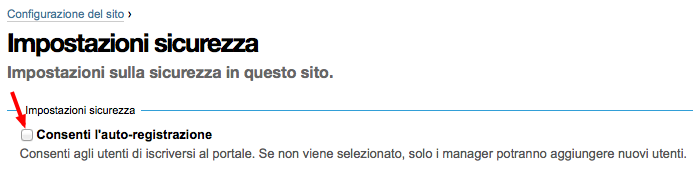

==========
I Permessi
==========

Al capitolo precedente è stata data la definizione di ruolo e si è visto come questo sia associato
direttamente con i **permessi**.
Si è anzi detto come *il ruolo non sia altro che un raggruppamento di permessi*.

Se un utente con ruolo di *Editor* può fare alcune delle cose possibili anche al *Revisore*
(accedere alla vista dei contenuti di una cartella, modificare un documento, ...) è dovuto al fatto
che condividono uno o più permessi.

I permessi sono il vero cuore della sicurezza di Plone, poiché controllano una singola azione o un
comportamento puntuale del CMS.

Sappiate però che agiscono a basso livello; fin'ora ci siamo abituati a lavorare sull'interfaccia
di Plone, per poi muoverci brevemente a livelli più bassi (in ZMI) e abbiamo visto poco codice.
I permessi invece *non sono visibili o gestiti a livello Plone* (per questo motivo non sono nemmeno
tradotti).

In questo capitolo non scenderemo ad un livello di dettaglio eccessivo poiché non risulta utile a
meno che la vostra intenzione non sia diventare uno sviluppatore di prodotti Plone (il che esula
dallo scopo di questo libro).

Vi basti sapere che la singola chiamata ad un metodo di una classe Python potrebbe essere protetta
da un permesso, il che significa che quando quel metodo viene chiamato per reagire ad un'azione di
un utente, viene verificato se l'utente possiede il permesso richiesto.
In caso contrario viene lanciata un'eccezione speciale: **Unauthorized** (**Non autorizzato**) che,
di solito, genera la classica pagina di permessi insufficienti di Plone.

.. figure:: _static/unauthorized-error.png
   :alt: Non autorizzato

   *La classica pagina di errore di Plone per permessi insufficienti*

In altri casi, alcuni comportamenti controllabili da ZMI (come ad esempio l'accesso a vari aspetti
dell'interfaccia grafica di Plone) sono controllati da permessi: avere il permesso richiesto
determina se l'elemento grafico compaia o meno. 

La gestione dei permessi
========================

La gestione dei permessi avviene da ZMI, dalla radice del sito, dalla stessa pagina da cui abbiamo
creato in precedenza un nuovo ruolo: la scheda **Security**.

.. figure:: _static/zmi-manage-security-link.png
   :alt: Link alla manage access in ZMI

   *Link per andare alla gestione della sicurezza del sito Plone, da ZMI*

Un accesso diretto alla pagina (che permette anche di non aprirla nel solito frame HTML usato dalla
ZMI) è richiamare manualmente ``/manage_access`` sul contesto del sito Plone.

Ad esempio: se state facendo test su un sito locale dovrete probabilmente digitare:

    http://localhost:8080/book/manage_access

Quello che vi troverete davanti è una griglia la cui logica è riassunta nello schema seguente.

.. figure:: _static/zmi-security-grid-for-dummies.png
   :alt: Struttura generale della gestioned della sicurezza

   *Schema generale della gestione della sicurezza del sito*

In **riga** avrete disponibili i permessi, e come potete vedere in un sito Plone possono essere
davvero molti.

In **colonna** ci sono i ruoli, tutti i ruoli definiti, che siano Zope, Plone o applicativi
(anche il nostro *Super Revisore* si trova qui).

Preso come riferimento un qualunque permesso e un qualunque ruolo, trovate all'incrocio della riga
e della colonna un checkbox:

* se il checkbox è *selezionato* quel ruolo ha il relativo permesso nel contesto (il sito Plone).
* Se il checkbox è *deselezionato* quel ruolo non ha il permesso.

Capire "Acquire permission settings?"
-------------------------------------

Avrete notato la presenta di una serie di checkbox in prima colonna con intestazione "**Acquire
permission settings?**".

Il loro significato è estremamente importante e diventerà vitale per la realizzazione di buoni
workflow.

Noterete infatti come per tantissimi permessi non ci sia nessuno dei checkbox della griglia
selezionati ma solo quello dell'acquisizione (che è quasi sempre selezionato, in ogni permesso).

Il suo significato è "*acquisisci permessi dal livello superiore/dal contenitore*".

Ci si potrebbe chiedere quale possa essere il "contenitore" del sito Plone e la risposa è: la
**radice di Zope**.
Anche questa infatti è una specie di cartella, dove i siti Plone diventano dei semplici contenuti e
da dove è possibile ancora una volta accedere alla scheda "*Security*".

.. figure:: _static/zmi-security-zope-root.png
   :alt: La gestione della sicurezza alla radice di Zope

   *Come si presenta la gestione della sicurezza sulla radice di Zope*

I permessi che troverete qui sono gli stessi del sito Plone, l'unica differenza sta nei *ruoli*:
qui troverete solo i ruoli predefinti di Zope e non quelli Plone o il nostro *Super Revisore*.

Di tutti i permessi definiti troverete come sia assegnato al ruolo *Manager* (ovviamente), a volte
al ruolo *Anonimo* (poiché gli anonimi devono poter fare determinate cose) e *Owner* (scelta non
sempre corretta).

A parità di permesso, le impostazioni di sicurezza definite qui si vanno a sommare a quelle
definite nello stesso permesso del sito Plone *se* il checkbox "*Acquire*" è selezionato.

Se l'acquisizione è deselezionata, le impostazioni al livello superiore vengono ignorate.

Modifiche ai permessi al di fuori della radice del sito
-------------------------------------------------------

La modifica dei permessi sulla radice del sito è normale amministrazione del lavoro con Plone per
personalizzare ai propri bisogni la sicurezza.

La modifica dei permessi nella radice di Zope è meno comune ma comunque possibile e lecita.

Nella sezione ":ref:`section-check-user-roles`" abbiamo visto come la pagina di modifica della
security sia accessibile anche al di fuori della radice del sito (anche se nascosta).

L'avvertimento dato in precedenza è talmente importante che vale la pena ripeterlo:

.. Warning::
    Modificare le impostazioni di sicurezza via ZMI in sezioni che non siano la radice del sito
    Plone può portare a problemi difficili da capire.

Il funzionamento dei permessi nei contenuti
===========================================

Pur tuttavia il cuore della sicurezza in Plone sta tutta qui: per sapere se un utente ha il potere
di fare una certa azione in un dato contesto, viene verificato se è in possesso di uno specifico
permesso, e nella maggior parte dei casi questo permesso è controllato sul contesto stesso.

Vediamo ad esempio cosa succede se accediamo alla gestione della sicurezza di un contenuto news in
stato *privato*.

   *Come sono impostati i permessi di una news privata*

Noterete come ci siano varie impostazioni personalizzate e non solo una serie infinita di
"Acquire".

Per rendere le cose semplici ci concentreremo solo su un permesso: *View*, ossia il permesso che
determina se il contenuto può essere visto o meno (verrà trattato molto nel dettaglio in seguito).

*Qualcosa* ha determinato che quel contenuto (la news) sia visibile (e quindi accessibile) solo dai
ruoli *Contributore*, *Editor*, *Manager*, *Possessore*, *Lettore* e *Amministratore del sito*.

Per questo motivo chiunque sia sprovvisto di questi ruoli nel contesto della news, non potrà
accedervi (ed otterrà l'errore permessi insufficienti).

Chi però governa questi permessi sulla news è il **workflow ad essa associato**.

Analisi puntuale dei permessi
=============================

Se fin'ora vi siete spaventati di fronte alla grande quantità di permessi che Plone offre,
e alla mancanza di una descrizione dettagliata sul loro significato, sappiate che le cose non
stanno così male.

Molti dei permessi che vedere sono definiti dagli strati software più bassi e **non serve gestirli
in Plone**.
Per questi permessi potete lasciare il valore predefinito e dimenticarvi di loro.

E' però vera la seconda osservazione: non ci sono descrizioni del funzionamenti dei permessi ma è
importante sapere a cosa servono.
Per questo analizzeremo in ordine tutti i permessi Plone che vale la pena conoscere.

.. _section-old-topic-permissions:

ATContentTypes Topic: Add *...Criterion*
----------------------------------------

Questa grande serie di permessi è storicamente collegata alle **vecchie collezioni**, ancora
presenti in Plone ma disabilitate e sostituite con una nuova versione a partire da Plone 4.2. 

Se vi ritrovate a gestire versioni di Plone più vecchie di questa o se siete di fronte ad un sito
Plone migrato da una vecchia versione (le vecchie collezioni non vengono trasformate nelle nuove
versioni nel processo di migrazione) vale la pena continuare la lettura.

Questi permessi controllavano il potere di un utente di poter usare uno specifico criterio.
Per fortuna ora non serve più occuparsene.

Per impostazione predefinita: solo *Manager* e *Amministratore del sito* posseggono questi
permessi.

.. _section-permissions-atct-add-all:

ATContentTypes: Add *tipo di contenuto*
---------------------------------------

Questa serie di permessi controllano il potere di **poter aggiungere un tipo di contenuto** e ne
esiste uno per ogniuno dei tipi base di Plone.

Il prefisso *ATContentTypes* identifica uno dei prodotti Plone centrali che è per l'appunto
`Products.ATContentTypes`__.
Questo prodotto è quello che fornisce i tipi base di Plone basati sul framework `Archetypes`__.

__ http://pypi.python.org/pypi/Products.ATContentTypes
__ http://pypi.python.org/pypi/Products.Archetypes

Segue uno a uno la lista dei permessi e una brevissima spiegazione.

`ATContentTypes: Add Document`
    Aggiunta di una **Pagina** (*Document* è il vecchio nome della *Pagina* ma era considerato
    troppo generico e per questo cambiato).

`ATContentTypes: Add Event`
    Aggiunta di un **Evento**.

`ATContentTypes: Add File`
    Aggiunta di un **File**.

`ATContentTypes: Add Folder`
    Aggiunta di una **Cartella**.

`ATContentTypes: Add Image`
    Aggiunta di un'**Immagine**.

`ATContentTypes: Add Large Plone Folder`
    Aggiunta di una **Cartella capiente**.
    
    Questo vecchio tipo di contenuto esisteva fino a Plone 4 escluso, dove c'era una differenza
    tra le cartelle semplici (e ordinabili) e quelle capienti che potevano contenere migliaia di
    oggetti senza problemi alle prestazioni (ma non ordinabili).
    
    Con Plone 4 esiste `solo un tipo di cartella`__ con tutti i pregi e nessuno dei difetti dei
    precedenti due tipi.

__ http://pypi.python.org/pypi/plone.app.folder

`ATContentTypes: Add Link`
    Aggiunta di un **Collegamento**.

`ATContentTypes: Add News Item`
    Aggiunta di una *News*

Noterete come da questa lista sia assente la *Collezione*, poiché per ragioni storiche la sua
aggiungibilità è gestita dal permesso ":ref:`section-permissions-add-portal-topic`".

Manipolare questi permessi si traduce letteralmente nel far sparire dal menù per l'aggiunta di
nuovi elementi il tipo relativo.
La differenza con la voce "*Restrizioni...*" dello stesso menù è sostanziale, poiché quella
limitazione viene fatta per singola cartella.

Per impostazione predefinita i seguenti ruoli posseggono questi permessi:

* *Manager*
* *Amministratore del sito*
* *Possessore*
* *Contributore*

.. Note::
    Il fatto che in questa lista compaia il *Possessore* ci dice una cosa importante (e molto
    spesso sbagliata).
    Un utente che sia in grado di creare una cartella avrà il potere di inserirvi all'interno
    tutti i contenuti che vuole.

Vedere anche ":ref:`section-permissions-add-portal-content`".

Access contents information
---------------------------

Questo permesso è tanto difficile da spiegare quanto importante, letteralmente tradotto in
"*accedere alle informazioni dei contenuti*".

Il suo uso è sparso qua è là nel codice Plone senza che sia esattamento chieato il suo scopo.

Nella pratica è un permesso che solitamente viaggia a stretto contatto col più famoso permesso
**View** e di solito viene assegnato e negato agli stessi ruoli negli stessi contesti.

Per impostazione predefinita i seguenti ruoli posseggono questo permesso:

* *Manager*
* *Amministratore del sito*
* *Possessore*
* *Contributore*
* *Lettore*
* *Editor*

Access inactive portal content
------------------------------

Questo permesso è quello che controlla il comportamento delle **date di scadenza e di pubblicazione
dei contenuti**.

La sua impostazione modifica le ricerche di Plone e l'accesso alle viste dei contenuti delle
cartelle.

Capire il suo funzionamento è molto importante poiché molti utenti credono che la scadenza di un
contenuto abbia a che fare con il permesso di accedervi.

Fortunatamente ho già affrontato l'argomento in passato in un articolo piuttosto dettagliato (ed
ancora valido):
"`Data di Scadenza/Pubblicazione in Plone: la guida definitiva`__".

__ http://blog.keul.it/2011/08/data-di-scadenzapubblicazione-in-plone.html

Per impostazione predefinita i seguenti ruoli posseggono questo permesso:

* *Manager*
* *Amministratore del sito*
* *Possessore* (il che, come spiegato nell'articolo sopra citato, non vuol dire nulla)

.. _section-permissions-add-portal-content:

Add portal content
------------------

Storicamente questo permesso era *il* permesso per aggiungere contenuti nel sito.
Prima di Plone 2.1 esisteva solo questo permesso per controllare l'aggiungibilità dei contenuti e
controllava *tutti* i contenuti.

I limiti si un simile approccio si solo rivelati molti presto e si è poi arrivati ad avere un
permesso per ogni contenuto, come descritto nella sezione
":ref:`section-permissions-atct-add-all`".

Il permesso però rimane importante ancora oggi perché dovrebbe determinare il potere di "*poter
aggiungere contenuti*" senza specificare quali.

In passato non avere questo permesso determinava infatti la possibilità di non poter aggiungere
contenuti ma questa caratteristica pare essere sparita in una qualche versione di Plone.

Ad ogni modo: il permesso è ancora usato per varie verifiche di sicurezza nel codice Plone quindi
non va ignorato completamente.

Per impostazione predefinita i seguenti ruoli posseggono questo permesso:

* *Manager*
* *Amministratore del sito*
* *Possessore*
* *Contributore*

Add portal member
-----------------

E' il permesso che controlla il potere di creare nuovi utenti nel sito.

Oltre al *Manager* e all'*Amministratore del sito* se viene aggiunto anche il ruolo *Anonimo* si
abilita la libertà dei visitatori di iscriversi al sito.

Oggi è raramente manipolato manualmente poiché è stato aggiunto un controllo specifico nella
sezione "*Sicurezza*" della configurazione del sito.

   *Il controllo nella gestione della "Sicurezza" del sito, che permette di abilitare
   l'auto-registrazione degli utenti*

.. _section-permissions-add-portal-topic:

Add portal topics
-----------------

E' il permesso che determina il potere di aggiungere nuove **Collezioni** nel sito Plone (*Topic*
è stato il primo nome del tipo di contenuto, poi diventato *Cercatore* ed infine ha preso il nome
odierno).

Vale quanto detto per gli altri
:ref:`permessi di aggiungibilità dei contenuti <section-permissions-atct-add-all>` Plone, ma i
ruoli che lo posseggono sono solo i seguenti *Manager* e *Amministratore del sito*.

Allow sendto
------------

E' il permesso che permette di utilizzare una vista che permette di inviare un collegamento al
documento corrente per e-mail.

Il link a questa pagina è stato disabilitato di default nelle recenti versioni di Plone (in realtà
non è una funzionalità così utile e probabilmente il link così esposto era facile preda di crawler
malevoli).

E' ancora utilizzabile conoscendone l'URL (inserendo ``/sendto_form`` dopo l'URL di un documento)
o riabilitando il link dal ``portal_actions`` in ZMI.

Il permesso è dato al ruolo *Anonimo*, quindi chiunque può utilizzare questo form. 

CMFEditions: *...*
------------------

`CMFEditions`__ è uno dei componenti di Plone che si occupa del versionamento dei contenuti.

Usando Plone infatti, ogni volta che viene eseguita una modifica ad un contenuto definito
"versionabile", viene salvata la copia precedente, creando così una storia potenzialmente infinita
del documento.

__ http://pypi.python.org/pypi/Products.CMFEditions

.. Note::
    Non va confusa la storia di un documento Plone con le transazioni dello ZODB.
    L'esecuzione dell'operazione di *pack dello ZODB* di un sito Plone *non* interferisce col
    numero di versioni di un documento salvate.

Il prodotto definisce quindi una serie di permessi aggiuntivi, tutti raccolti sotto il prefisso
*CMFEditions*.
A noi interessa anlizzare solo un sotto-insieme di questi permessi.

CMFEditions: Access previous versions
~~~~~~~~~~~~~~~~~~~~~~~~~~~~~~~~~~~~~

Questo permesso determina il potere dell'utente di accedere alla storia del documento e controlla
la comparsa del link "*Cronologia*" e l'effettivo potere di utilizzarne le funziomalità.

.. figure:: _static/history-link.png
   :alt: Link alla cronologia

   *Il link alla "Cronologia" dal documento*

CMFEditions: Apply version control
~~~~~~~~~~~~~~~~~~~~~~~~~~~~~~~~~~

usato ma sembra non fare nulla

CMFEditions: Checkout to location
~~~~~~~~~~~~~~~~~~~~~~~~~~~~~~~~~

CMFEditions: Revert to previous versions
~~~~~~~~~~~~~~~~~~~~~~~~~~~~~~~~~~~~~~~~

CMFEditions: Save new version
~~~~~~~~~~~~~~~~~~~~~~~~~~~~~

 