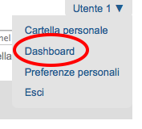

==========
I Permessi
==========

.. only:: not latex

    .. contents:: Indice della sezione

Al capitolo precedente è stata data la definizione di ruolo e si è visto come questo sia associato
direttamente con i **permessi**.
Si è anzi detto come *il ruolo non sia altro che un raggruppamento di permessi*.

Se un utente con ruolo di *Editor* può fare alcune delle cose possibili anche al *Revisore*
(accedere alla vista dei contenuti di una cartella, modificare un documento, ...) è dovuto al fatto
che condividono uno o più permessi.

I permessi sono il vero cuore della sicurezza di Plone, poiché controllano una singola azione o un
comportamento puntuale del CMS.

Sappiate però che agiscono a basso livello; fin'ora ci siamo abituati a lavorare sull'interfaccia
di Plone, per poi muoverci brevemente a livelli più bassi (in ZMI) e abbiamo visto poco codice.
I permessi invece *non sono visibili o gestiti a livello Plone* (per questo motivo non sono nemmeno
tradotti).

In questo capitolo non scenderemo ad un livello di dettaglio eccessivo poiché non risulta utile a
meno che la vostra intenzione non sia diventare uno sviluppatore di prodotti Plone (il che esula
dallo scopo di questo libro).

Vi basti sapere che la singola chiamata ad un metodo di una classe Python potrebbe essere protetta
da un permesso, il che significa che quando quel metodo viene chiamato per reagire ad un'azione di
un utente, viene verificato se l'utente possiede il permesso richiesto.
In caso contrario viene lanciata un'eccezione speciale: **Unauthorized** (**Non autorizzato**) che,
di solito, genera la classica pagina di permessi insufficienti di Plone.

.. figure:: _static/unauthorized-error.png
   :alt: Non autorizzato

   *La classica pagina di errore di Plone per permessi insufficienti*

In altri casi, alcuni comportamenti controllabili da ZMI (come ad esempio l'accesso a vari aspetti
dell'interfaccia grafica di Plone) sono controllati da permessi: avere il permesso richiesto
determina se l'elemento grafico compaia o meno. 

La gestione dei permessi
========================

La gestione dei permessi avviene da ZMI, dalla radice del sito, dalla stessa pagina da cui abbiamo
creato in precedenza un nuovo ruolo: la scheda **Security**.

.. figure:: _static/zmi-manage-security-link.png
   :alt: Link alla manage access in ZMI

   *Link per andare alla gestione della sicurezza del sito Plone, da ZMI*

Un accesso diretto alla pagina (che permette anche di non aprirla nel solito frame HTML usato dalla
ZMI) è richiamare manualmente ``/manage_access`` sul contesto del sito Plone.

Ad esempio: se state facendo test su un sito locale dovrete probabilmente digitare:

    http://localhost:8080/book/manage_access

Quello che vi troverete davanti è una griglia la cui logica è riassunta nello schema seguente.

.. figure:: _static/zmi-security-grid-for-dummies.png
   :alt: Struttura generale della gestioned della sicurezza

   *Schema generale della gestione della sicurezza del sito*

In **riga** avrete disponibili i permessi, e come potete vedere in un sito Plone possono essere
davvero molti.

In **colonna** ci sono i ruoli, tutti i ruoli definiti, che siano Zope, Plone o applicativi
(anche il nostro *Super Revisore* si trova qui).

Preso come riferimento un qualunque permesso e un qualunque ruolo, trovate all'incrocio della riga
e della colonna un checkbox:

* se il checkbox è *selezionato* quel ruolo ha il relativo permesso nel contesto (il sito Plone).
* Se il checkbox è *deselezionato* quel ruolo non ha il permesso.

Capire "Acquire permission settings?"
-------------------------------------

Avrete notato la presenta di una serie di checkbox in prima colonna con intestazione "**Acquire
permission settings?**".

Il loro significato è estremamente importante e diventerà vitale per la realizzazione di buoni
workflow.

Noterete infatti come per tantissimi permessi non ci sia nessuno dei checkbox della griglia
selezionati ma solo quello dell'acquisizione (che è quasi sempre selezionato, in ogni permesso).

Il suo significato è "*acquisisci permessi dal livello superiore/dal contenitore*".

Ci si potrebbe chiedere quale possa essere il "contenitore" del sito Plone e la risposa è: la
**radice di Zope**.
Anche questa infatti è una specie di cartella, dove i siti Plone diventano dei semplici contenuti e
da dove è possibile ancora una volta accedere alla scheda "*Security*".

.. figure:: _static/zmi-security-zope-root.png
   :alt: La gestione della sicurezza alla radice di Zope

   *Come si presenta la gestione della sicurezza sulla radice di Zope*

I permessi che troverete qui sono gli stessi del sito Plone, l'unica differenza sta nei *ruoli*:
qui troverete solo i ruoli predefinti di Zope e non quelli Plone o il nostro *Super Revisore*.

Di tutti i permessi definiti troverete come sia assegnato al ruolo *Manager* (ovviamente), a volte
al ruolo *Anonimo* (poiché gli anonimi devono poter fare determinate cose) e *Owner* (scelta non
sempre corretta).

A parità di permesso, le impostazioni di sicurezza definite qui si vanno a sommare a quelle
definite nello stesso permesso del sito Plone *se* il checkbox "*Acquire*" è selezionato.

Se l'acquisizione è deselezionata, le impostazioni al livello superiore vengono ignorate.

Modifiche ai permessi al di fuori della radice del sito
-------------------------------------------------------

La modifica dei permessi sulla radice del sito è normale amministrazione del lavoro con Plone per
personalizzare ai propri bisogni la sicurezza.

La modifica dei permessi nella radice di Zope è meno comune ma comunque possibile e lecita.

Nella sezione ":ref:`section-check-user-roles`" abbiamo visto come la pagina di modifica della
security sia accessibile anche al di fuori della radice del sito (anche se nascosta).

L'avvertimento dato in precedenza è talmente importante che vale la pena ripeterlo:

.. Warning::
    Modificare le impostazioni di sicurezza via ZMI in sezioni che non siano la radice del sito
    Plone può portare a problemi difficili da capire.

Il funzionamento dei permessi nei contenuti
===========================================

Pur tuttavia il cuore della sicurezza in Plone sta tutta qui: per sapere se un utente ha il potere
di fare una certa azione in un dato contesto, viene verificato se è in possesso di uno specifico
permesso, e nella maggior parte dei casi questo permesso è controllato sul contesto stesso.

Vediamo ad esempio cosa succede se accediamo alla gestione della sicurezza di un contenuto news in
stato *privato*.

.. figure:: _static/zmi-security-private-news.png
   :alt: Vista Security di una news privata

   *Come sono impostati i permessi di una news privata*

Noterete come ci siano varie impostazioni personalizzate e non solo una serie infinita di
"Acquire".

Per rendere le cose semplici ci concentreremo solo su un permesso: *View*, ossia il permesso che
determina se il contenuto può essere visto o meno (verrà trattato molto nel dettaglio in seguito).

*Qualcosa* ha determinato che quel contenuto (la news) sia visibile (e quindi accessibile) solo dai
ruoli *Contributore*, *Editor*, *Manager*, *Possessore*, *Lettore* e *Amministratore del sito*.

Per questo motivo chiunque sia sprovvisto di questi ruoli nel contesto della news, non potrà
accedervi (ed otterrà l'errore permessi insufficienti).

Chi però governa questi permessi sulla news è il **workflow ad essa associato**.

Analisi puntuale dei permessi
=============================

Se fin'ora vi siete spaventati di fronte alla grande quantità di permessi che Plone offre,
e alla mancanza di una descrizione dettagliata sul loro significato, sappiate che le cose non
stanno così male.

Molti dei permessi che vedere sono definiti dagli strati software più bassi e **non serve gestirli
in Plone**.
Per questi permessi potete lasciare il valore predefinito e dimenticarvi di loro.

E' però vera la seconda osservazione: non ci sono descrizioni del funzionamenti dei permessi ma è
importante sapere a cosa servono.
Per questo analizzeremo in ordine tutti i permessi Plone che vale la pena conoscere.

.. _section-old-topic-permissions:

ATContentTypes Topic: Add *...Criterion*
----------------------------------------

Questa grande serie di permessi è storicamente collegata alle **vecchie collezioni**, ancora
presenti in Plone ma disabilitate e sostituite con una nuova versione a partire da Plone 4.2. 

Se vi ritrovate a gestire versioni di Plone più vecchie di questa o se siete di fronte ad un sito
Plone migrato da una vecchia versione (le vecchie collezioni non vengono trasformate nelle nuove
versioni nel processo di migrazione) vale la pena continuare la lettura.

Questi permessi controllavano il potere di un utente di poter usare uno specifico criterio.
Per fortuna ora non serve più occuparsene.

Per impostazione predefinita: solo *Manager* e *Amministratore del sito* posseggono questi
permessi.

.. _section-permissions-atct-add-all:

ATContentTypes: Add *tipo di contenuto*
---------------------------------------

Questa serie di permessi controllano il potere di **poter aggiungere un tipo di contenuto** e ne
esiste uno per ogniuno dei tipi base di Plone.

Il prefisso *ATContentTypes* identifica uno dei prodotti Plone centrali che è per l'appunto
`Products.ATContentTypes`__.
Questo prodotto è quello che fornisce i tipi base di Plone basati sul framework `Archetypes`__.

__ http://pypi.python.org/pypi/Products.ATContentTypes
__ http://pypi.python.org/pypi/Products.Archetypes

Segue uno a uno la lista dei permessi e una brevissima spiegazione.

`ATContentTypes: Add Document`
    Aggiunta di una **Pagina** (*Document* è il vecchio nome della *Pagina* ma era considerato
    troppo generico e per questo cambiato).

`ATContentTypes: Add Event`
    Aggiunta di un **Evento**.

`ATContentTypes: Add File`
    Aggiunta di un **File**.

`ATContentTypes: Add Folder`
    Aggiunta di una **Cartella**.

`ATContentTypes: Add Image`
    Aggiunta di un'**Immagine**.

`ATContentTypes: Add Large Plone Folder`
    Aggiunta di una **Cartella capiente**.
    
    Questo vecchio tipo di contenuto esisteva fino a Plone 4 escluso, dove c'era una differenza
    tra le cartelle semplici (e ordinabili) e quelle capienti che potevano contenere migliaia di
    oggetti senza problemi alle prestazioni (ma non ordinabili).
    
    Con Plone 4 esiste `solo un tipo di cartella`__ con tutti i pregi e nessuno dei difetti dei
    precedenti due tipi.

__ http://pypi.python.org/pypi/plone.app.folder

`ATContentTypes: Add Link`
    Aggiunta di un **Collegamento**.

`ATContentTypes: Add News Item`
    Aggiunta di una *News*

Noterete come da questa lista sia assente la *Collezione*, poiché per ragioni storiche la sua
aggiungibilità è gestita dal permesso ":ref:`section-permissions-add-portal-topic`".

Manipolare questi permessi si traduce letteralmente nel far sparire dal menù per l'aggiunta di
nuovi elementi il tipo relativo.
La differenza con la voce "*Restrizioni...*" dello stesso menù è sostanziale, poiché quella
limitazione viene fatta per singola cartella.

Per impostazione predefinita i seguenti ruoli posseggono questi permessi:

* *Manager*
* *Amministratore del sito*
* *Possessore*
* *Contributore*

.. Note::
    Il fatto che in questa lista compaia il *Possessore* ci dice una cosa importante (e molto
    spesso sbagliata).
    Un utente che sia in grado di creare una cartella avrà il potere di inserirvi all'interno
    tutti i contenuti che vuole.

Vedere anche ":ref:`section-permissions-add-portal-content`".

Access contents information
---------------------------

Questo permesso è tanto difficile da spiegare quanto importante, letteralmente tradotto in
"*accedere alle informazioni dei contenuti*".

Il suo uso è sparso qua è là nel codice Plone senza che sia esattamento chieato il suo scopo.

Nella pratica è un permesso che solitamente viaggia a stretto contatto col più famoso permesso
**View** e di solito viene assegnato e negato agli stessi ruoli negli stessi contesti.

Per impostazione predefinita i seguenti ruoli posseggono questo permesso:

* *Manager*
* *Amministratore del sito*
* *Possessore*
* *Contributore*
* *Lettore*
* *Editor*

Access inactive portal content
------------------------------

Questo permesso è quello che controlla il comportamento delle **date di scadenza e di pubblicazione
dei contenuti**.

La sua impostazione modifica le ricerche di Plone e l'accesso alle viste dei contenuti delle
cartelle.

Capire il suo funzionamento è molto importante poiché molti utenti credono che la scadenza di un
contenuto abbia a che fare con il permesso di accedervi.

Fortunatamente ho già affrontato l'argomento in passato in un articolo piuttosto dettagliato (ed
ancora valido):
"`Data di Scadenza/Pubblicazione in Plone: la guida definitiva`__".

__ http://blog.keul.it/2011/08/data-di-scadenzapubblicazione-in-plone.html

Per impostazione predefinita i seguenti ruoli posseggono questo permesso:

* *Manager*
* *Amministratore del sito*
* *Possessore* (il che, come spiegato nell'articolo sopra citato, non vuol dire nulla)

.. _section-permissions-add-portal-content:

Add portal content
------------------

Storicamente questo permesso era *il* permesso per aggiungere contenuti nel sito.
Prima di Plone 2.1 esisteva solo questo permesso per controllare l'aggiungibilità dei contenuti e
controllava *tutti* i contenuti.

I limiti si un simile approccio si solo rivelati molti presto e si è poi arrivati ad avere un
permesso per ogni contenuto, come descritto nella sezione
":ref:`section-permissions-atct-add-all`".

Il permesso però rimane importante ancora oggi perché dovrebbe determinare il potere di "*poter
aggiungere contenuti*" senza specificare quali.

In passato non avere questo permesso determinava infatti la possibilità di non poter aggiungere
contenuti ma questa caratteristica pare essere sparita in una qualche versione di Plone.

Ad ogni modo: il permesso è ancora usato per varie verifiche di sicurezza nel codice Plone quindi
non va ignorato completamente.

Per impostazione predefinita i seguenti ruoli posseggono questo permesso:

* *Manager*
* *Amministratore del sito*
* *Possessore*
* *Contributore*

Add portal member
-----------------

E' il permesso che controlla il potere di creare nuovi utenti nel sito.

Oltre al *Manager* e all'*Amministratore del sito* se viene aggiunto anche il ruolo *Anonimo* si
abilita la libertà dei visitatori di iscriversi al sito.

Oggi è raramente manipolato manualmente poiché è stato aggiunto un controllo specifico nella
sezione "*Sicurezza*" della configurazione del sito.

.. figure:: _static/site-security-free-registration.png
   :alt: Il controllo per abilitare l'autoregistrazione

   *Il controllo nella gestione della "Sicurezza" del sito, che permette di abilitare
   l'auto-registrazione degli utenti*

.. _section-permissions-add-portal-topic:

Add portal topics
-----------------

E' il permesso che determina il potere di aggiungere le vecchie **Collezioni** nel sito Plone
(*Topic* è stato il primo nome del tipo di contenuto, poi diventato *Cercatore* ed infine ha
preso il nome odierno).

Vale quanto detto per gli altri
:ref:`permessi di aggiungibilità dei contenuti <section-permissions-atct-add-all>` Plone, ma i
ruoli che lo posseggono sono solo i seguenti *Manager* e *Amministratore del sito*.

Ignorate questo permesso se non dovete gestire le vecchie collezioni.

.. _section-permissions-allow-sento:

Allow sendto
------------

E' il permesso che permette di utilizzare una vista che permette di inviare un collegamento al
documento corrente per e-mail.

Il link a questa pagina è stato disabilitato di default nelle recenti versioni di Plone (in realtà
non è una funzionalità così utile e probabilmente il link così esposto era facile preda di crawler
malevoli).

E' ancora utilizzabile conoscendone l'URL (inserendo ``/sendto_form`` dopo l'URL di un documento)
o riabilitando il link dal ``portal_actions`` in ZMI.

Il permesso è dato al ruolo *Anonimo*, quindi chiunque può utilizzare questo form. 

.. _section-permissions-cmfeditions-set:

CMFEditions: *...*
------------------

`CMFEditions`__ è uno dei componenti di Plone che si occupa del versionamento dei contenuti.

Usando Plone infatti, ogni volta che viene eseguita una modifica ad un contenuto definito
"versionabile", viene salvata la copia precedente, creando così una storia potenzialmente infinita
del documento.

__ http://pypi.python.org/pypi/Products.CMFEditions

Il prodotto è in qualche modo legato ad un'altro dei componenti di Plone (disattivato di default
ma presente in ogni installazione) che è il supporto alla `copia di lavoro`__ (*Working Copy*).
Questo prodotto aggiunge numerose opzioni nel menù "*Azioni*".

__ http://pypi.python.org/pypi/plone.app.iterate

Va detto che il codice che si occupa del versionamento di Plone è piuttosto confuso e non sempre è
facile capirne il funzionamento.
Anche analizzando il codice si rischia spesso di trovarsi a verificare librerie sempre diverse,
tutte in qualche modo collegate.

.. Note::
    Non va confusa la storia di un documento Plone con le transazioni dello ZODB.
    L'esecuzione dell'operazione di *pack dello ZODB* di un sito Plone *non* interferisce col
    numero di versioni di un documento salvate.

Il prodotto definisce quindi una serie di permessi aggiuntivi, tutti raccolti sotto il prefisso
*CMFEditions*.
A noi interessa anlizzare solo un sotto-insieme di questi permessi poiché altri permessi sono solo
usati a basso livello.

CMFEditions: Access previous versions
~~~~~~~~~~~~~~~~~~~~~~~~~~~~~~~~~~~~~

Questo permesso determina il potere dell'utente di accedere alla storia del documento e controlla
la comparsa del link "*Cronologia*" e l'effettivo potere di utilizzarne le funziomalità.

   *Il link alla "Cronologia" dal documento*

CMFEditions: Apply version control
~~~~~~~~~~~~~~~~~~~~~~~~~~~~~~~~~~

Questo permesso viene qui documentato solo perché *sembra* usato da uno dei metodi che si occupano
del versionamento dei contenuti (``applyVersionControl``, nel tool
``CopyModifyMergeRepositoryTool``).
Dovrebbe essere utilizzato e verificato quando la storia del documento inizia (quindi alla sua
creazione).

In più un'installazione base di Plone imposta questo permesso ai ruoli *Contributore*, *Manager*,
*Possessore*, *Editor*, *Revisore* e *Amministratore del sito*.

Leggendo il codice, *sembrerebbe* che una verifica di questo permesso venga fatta se il metodo di
versionamento del contenuto è impostato su "Manuale" (una funzionalità di Plone usata piuttosto
raramente).

Dopo una prova empirica: anche rimuovendo il permesso a tutti i ruoli non sembra esserci nessun
effetto sul comportamento del versionamento.

Il consiglio è: tenete i ruoli predefiniti ma per sicurezza assegnate questo permesso anche ad
ipotetici nuovi ruoli che vorrete andare a creare e che possono avere poteri di modifica di
qualunque tipo sui contenuti.

CMFEditions: Checkout to location
~~~~~~~~~~~~~~~~~~~~~~~~~~~~~~~~~

Ci si potrebbe aspettare che questo permesso controlli la funzionalità del supporto alla copia di
lavoro di effettuare il **checkout** (la creazione della copia di lavoro) in una certa posizione.

Sbagliato... questo permesso non fa assolutamente nulla.
Eppure sono quasi certo che l'intenzione iniziale fosse esattamente questa.

CMFEditions: Revert to previous versions
~~~~~~~~~~~~~~~~~~~~~~~~~~~~~~~~~~~~~~~~

Questo permesso è collegato alla possibilità di tornare alla versione precedente di un contenuto.

Il problema è che nelle versioni moderne di Plone i template che controllano la storia sono
cambiati.

Oggi il controllo delle versioni avviene tramite un moderno popup.

.. figure:: _static/document-history-popup.png
   :alt: Popup della storia del documento

   *Come compare oggi la storia del documento, dopo aver cliccato sul link "Cronologia"*

Rimuovendo quel permesso agli utenti, visivamente non cambia nulla, il form rimane tale e quale.
Premendo però il pulsante "*Ripristina questa versione*" si ottiene il permesso di permessi
insufficienti.

Nei vecchi template di Plone, quando i controlli della versione del documento erano fatti tramite
il tab aggiuntivo "*Storia*" (oggi disabilitato) le cose vanno meglio.
La pagina è ancora oggi disponibile chiamando ``/versions_history_form`` sul contesto.

   *Vecchia pagina della storia del documento*

In questo vecchio template anche il pulsante "*Ripristina a questa versione*" sparisce
(comportamento ovviamente migliore).
Il comportamento attuale è molto probabilmente un piccolo bug, ma l'importante è che questo
permesso controlli davvero questo potere.

Per impostazione predefinita i seguenti ruoli posseggono questo permesso:

* *Manager*
* *Amministratore del sito*
* *Possessore*
* *Editor*
* *Revisore*

CMFEditions: Save new version
~~~~~~~~~~~~~~~~~~~~~~~~~~~~~

Questo permesso controlla il poter salvare una nuova versione di un documento, quindi in caso del
semplice versionamento (automatico o manuale che sia) è un permesso necessario anche per salvare
il documento.
Se il prodotto per il supporto alla "Copia di lavoro" è attivo, questo permesso controlla anche il
**checkin** del documento.

Nel caso del versionamento del contenuto Plone ha un comportamento che potrebbe non esse chiaro.
Se l'utente corrente ha il potere di modificare il documento, egli può entrare nella pagina di
modifica, ma se il versionamento è attivato e l'utente non possiede questo permesso, ottiene un
errore al salvataggio (poiché salvando si sta tentando di creare anche una nuova versione).

Forse la cosa andrebbe gestita in un altro modo (non creando una versione, oppure segnalando il
problema all'utente in un modo alternativo).

Se l'estensione per la copia di lavoro è attiva e si tenta di eseguire il *checkin*, la cosa sembra
funzionare ma non appena l'utente inserisce il commento alla modifica ottiene di nuovo l'errore
di permessi insufficienti.

Anche in questo caso il comportamento non è ottimale: sarebbe meglio che all'utente fosse inibita
la voce di menù che scatena il *checkin*.

Per impostazione predefinita i seguenti ruoli posseggono questo permesso:

* *Manager*
* *Amministratore del sito*
* *Possessore*
* *Contributore*
* *Editor*
* *Revisore*

La presenza del ruolo *Contributore* è dubbia (perché il *Contributore* ha il diritto di generare
una nuova versione di un documento?).

.. _section-permissions-change-portal-events:

Change portal events
--------------------

Questo permesso, per ragioni storiche, è il **permesso di modifica degli eventi**.

E' da gestire allo stesso modo con cui viene usato il più famoso *Modify portal content*.

Per impostazione predefinita i seguenti ruoli posseggono questo permesso:

* *Manager*
* *Amministratore del sito*
* *Possessore*

Change portal topics
--------------------

Questo permesso è storicamente associato al permesso di modifica delle *Collezioni*.

Se le *Collezioni* che state gestendo sono quelle introdotte con Plone 4.2, questo stesso permesso
è diventato inutile, poiché ora il permesso di riferimento è *Modify portal content*, come per
tutti gli altri tipi.

Questo permesso vale ancora la pena essere gestito se avete a che fare con le vecchie collezioni.
Vedere quanto detto per i
:ref:`vecchi permessi di gestione dei criteri <section-old-topic-permissions>`.

* *Manager*
* *Amministratore del sito*
* *Possessore*

Copy or Move 
------------

Questo permesso è legato alle operazioni di **copia** e **taglia**.

Non è nei fatti un permesso molto importante; per impostazione predefinita è infatti dato gli
*Anonimi* quindi a chiunque.
Il motivo è perché il vero "lavoro" viene fatto con l'operazione di *incolla*, che non è gestito
da questo permesso.

Vale la pena gestire questo permesso (magari in un workflow specifico) se per qualche motivo volete
rendere impossibile la copia o lo spostamento di un documento.
In questi casi il fatto che il permesso sia unificato per copia e taglia a volte crea problemi.

Delete objects
--------------

Questo permesso controlla il potere di cancellare contenuti ma vista la sua complessità e il suo
comportamento non sempre chiaro, verrà gestito in seguito in una sezione dedicata.

List folder contents
--------------------

Questo permesso è quello che permette agli utenti di vedere i contenuti di una cartella, quindi la
sua modifica ha effetti solo sui contenuti di tipo simil-cartella, e controlla la presenza del tab
"*Contenuti*".

Per impostazione predefinita i seguenti ruoli posseggono questo permesso:

* *Manager*
* *Amministratore del sito*
* *Possessore*
* *Contributore*
* *Editor*
* *Revisore*

In pratica tutti i ruoli che di solito hanno qualche tipo di potere dalla vista dei contenti della
cartella.

List portal members
-------------------

E' il permesso che controlla la possibilità di accedere alla lista degli utenti del sito.

Per impostazione predefinita questo permesso è dato ai *Manager*, all'*Amministratore del sito* e
al *Collaboratore* (quindi in pratica tutti gli utenti del sito possono vedere gli altri).

Vale la pena modificarlo in presenza di stringenti motivi di privacy.

.. _section-permissions-mail-forgotten-password:

Mail forgotten password
-----------------------

Anche se letteralmente la traduzione del permesso è *invio della password per e-mail* (in ricordo
dei tempi in cui Plone memorizzata le password in chiaro e le inviata agli utenti), oggi questo
permesso controlla il potere di ricevere il link per eseguire il reset della password in caso si
sia dimenticata.

Se volete disabilitare la funzionalità (magari perché le password non sono gestire in Plone ma in
un LDAP esterno) vale la pena togliere questo permesso a chiunque.

E' ovviamente dato agli utenti *Anonimi*.

.. _section-permissions-manage-groups:

Manage Groups
-------------

Era il permesso generale per poter gestire i gruppi di Plone.
 
Il permesso è in gran parte inutilizzato (alcune verifiche di questo sono ancora esistenti in
vecchi template di gestione gruppi e utenti, ora deprecati e che verranno rimossi con Plone 4.3.

.. _section-permissions-manage-portal:

Manage portal
-------------

.. Note::
    E' il permesso di riferimento del ruolo **Manager**

Questo permesso determina tantissimi poteri, tutti legati ad azioni che di solito può fare solo
il ruolo Manager.

Ad oggi può creare problemi di incompatibilità col ruolo "*Amministratore del sito*" in presenza
di prodotti che ancora non lo supportano
(vedere :ref:`la discussione relativa <section-roles-site-administrator-notes>`).

Un esempio classico è l'**uso delle portlet**.
In Plone le portlet sono sempre state gestire dal *Manager* e di recente dal nuovo ruolo
*Amministratore del sito* ma è possibile ancora oggi trovare prodotti aggiuntivi che forniscono
nuove portlet usando questo permesso e quindi inutilizzabili dal nuovo ruolo.

Manage users 
------------

Vedere quanto detto per ":ref:`section-permissions-manage-groups`".

Modify portal content
---------------------

.. Note::
    E' il permesso di riferimento del ruolo **Editor**

A parte qualche :ref:`eccezione degna di nota <section-permissions-change-portal-events>`, questo
è *il* permesso che identifica il potere di modificare i contenuti.

Per impostazione predefinita i seguenti ruoli posseggono questo permesso:

* *Manager*
* *Amministratore del sito*
* *Possessore*
* *Editor*

Ma il potere viene in realtà gestito altrove, nei workflow.

Modify view template
--------------------

Questo permesso controlla la comparsa del menù "*Vista*" e le funzionalità di poter scegliere una
vista per una cartella e un documento come vista predefinita.

C'è un solo permesso per entrambe le funzionalità, non è possibile quindi differenziare i
comportamenti.

.. figure:: _static/view-menu.png
   :alt: Menù "Vista"

   *Come si presenta il menù vista*

Per impostazione predefinita i seguenti ruoli posseggono questo permesso:

* *Manager*
* *Amministratore del sito*
* *Possessore*
* *Editor*

    
Plone Site Setup: *...*
-----------------------

Senza bisogno di scendere in ulteriori dettagli, Plone offre una serie di permessi che servono a
gestire in modo puntuale le voci nella *configurazione del sito*.

Per ogni pannello di configurazione c'è un permesso con prefisso "*Plone Site Setup:*".

Mettiamo solo in una minima evidenza due permessi in particolare:

`Plone Site Setup: Overview`
    E' il permesso principale, per accedere al pannello di controllo generale.
`Plone Site Setup: Users and Groups`
    Questo permesso serve ad accedere alla sezione di gestione gruppi e utenti e pare quindi aver
    sostituito i vecchi permessi "*Manage groups*" e "*Manage users*".
    
    **Questo permesso permette davvero di gestire utenti e gruppi** se assegnato ad altri ruoli
    (purtroppo, ancora una volta, non è possibile limitarsi ad uno dei due poteri).

Per impostazione predefinita i seguenti ruoli posseggono questo permesso:

* *Manager*
* *Amministratore del sito*

E' possibile quindi facilmente escludere uno dei pannelli di configurazione di Plone a qualunque
modifica, togliendo il permesso associato.

.. _section-permissions-manage-portlets:

Portlets: Manage portlets
-------------------------

E' il permesso che permette di accedere alla gestione delle portlet laterali ed è per questo motivo
assegnato al *Manager* e all'*Amministratore del sito*.

In assenza di un permesso specifico per gestire una nuova portlet (magari in seguito
all'installazione di un prodotto agiuntivo), questo è il permesso che andrebbe utilizzato, anche
se la cosa migliore sarebbe sempre quella di avere un permesso per ogni tipo di portlet.

Purtroppo questo non succede: tutte le portlet sono gestite da questo permesso a parte due
eccezioni degne di note:

* :ref:`section-permissions-plone-portlet-collection-add`
* :ref:`section-permissions-plone-portlet-static-add`

Portlets: View dashboard
------------------------

Permesso per poter vedere la propria **dashboard**.
Rimuovendo questo permesso però il link dal menù personale alla *dashboard* non viene rimosso, ma
si ottiene un errore per permessi insufficienti una cliccato.

   *Link alla Dashboard dal menù personale*

Per impostazione predefinita i seguenti ruoli posseggono questo permesso:

* *Manager*
* *Amministratore del sito*
* *Collaboratore*

In pratica: a tutti gli utenti del sito.

Reply to item
-------------

Questo permesso identifica il potere di poter **commentare**.

Il Plone i commenti sono ora controllati dal prodotto `plone.app.discussion`__ e possono anche
essere sottoposti a workflow.

__ http://pypi.python.org/pypi/plone.app.discussion

Tenete presente che il permesso controlla i commenti *se i commenti sono abilitati* sul contenuto.

Nella pratica infatti il permesso è dato a tutti gli *Autenticati*, ma di base nessun contenuto
Plone è di per se automaticamente commentabile.

.. _section-permissions-request-review:

Request review
--------------

E' il permesso che identifica il potere di un utente di sottoporre un documento alla richiesta
di revisione (di solito effettuata dal *Revisore*).

E' utilizzata in tutti i workflow base, ma se avete intenzione di creare un vostro workflow e
vi serve questa funzionalità, tenete presente questo permesso prima di volerne creare altri.

Per impostazione predefinita i seguenti ruoli posseggono questo permesso:

* *Manager*
* *Amministratore del sito*
* *Editor*
* *Possessore*

Review comments
---------------

Quando la revisione dei commenti è attivata, chi possiede questo permesso può effettuarne la
revisione.

Questo comportamento viene innanzi tutto abilitato dal pannello di controllo Plone, alla voce
"*Commenti*".

.. figure:: _static/comment-configuration-review.png
   :alt: L'abilitazione della revisione dei commenti

   *L'abilitazione della revisione dei commenti, dal pannello "Impostazioni dei commenti"*

Per impostazione predefinita i seguenti ruoli posseggono questo permesso:

* *Manager*
* *Amministratore del sito*
* *Revisore*

Il motivo per cui esista un permesso separato per la revisione dei commenti (e non venga usato
invece il permesso ":ref:`section-permissions-review-portal-content`" è opinabile.
Sarebbe stato possibile usare quello stesso permesso, applicato al workflow dei commenti.

.. _section-permissions-review-portal-content:

Review portal content
---------------------

.. Note::
    E' il permesso di riferimento del ruolo **Revisore**

Questo permesso identifica il potere di poter revisionare un contenuto del sito, di solito legato
ad una precedente richiesta di revisione ottenuta tramite uso di workfklow.

Come già discusso per il permesso ":ref:section-permissions-request-review", vale la pena
riutilizzare il permesso anche in presenza di workflow personalizzati.

Per impostazione predefinita i seguenti ruoli posseggono questo permesso:

* *Manager*
* *Amministratore del sito*
* *Revisore*

.. _section-permissions-set-own-password:

Set own password
----------------

E' il permesso associato alla funzionalità di poter cambiare la propria password dalla vista
"*Azzera la password*", accessibile tramite le proprie preferenze personali.

E' differente dal permesso ":ref:`section-permissions-mail-forgotten-password`" perché in questo
caso l'utente è autenticato nel sistema.
Anche in questo caso però potreste voler togliere questo permesso in casi di fonti dati utente
esterne (quali LDAP).

Il permesso è dato a tutti gli utenti *Autenticati*

Set own properties
------------------

E' il permesso legato al potere dell'utente di modificare le proprie informazioni personali.

Togliendo questo permesso (assegnato a tutti gli *Autenticati*) l'utente non è più in grado di
accedere alla voce "*Preferenze personali*" nel proprio menù di autenticazione.

Purtroppo non è la voce in se a sparire ma si ottiene un errore di permessi insufficienti nel caso
si clicchi sulla voce.

Sharing page: *...*
-------------------

Questa serie di permessi controlla l'accesso alla **pagina di condivisione** e la possibilità di
assegnare ad utenti e gruppi i singoli permessi disponibili in questa pagina.

Questi permessi sono già stati introdotti brevemente alla sezione
":ref:`section-access-sharing-page`" nel capitolo sui ruoli, ma il loro comportamento necessita
di una sezione apposita in seguito.

Use mailhost services
---------------------

Questo permesso è collegato all'utilizzo del sistema di invio e-mail interno di Plone.

Normalmente l'unico punto di contatto tra gli utenti del sito e le e-mail inviate dal sito si hanno
per l'invio del resert della password (":ref:`section-permissions-set-own-password`") e per l'invio
di un link alla pagina corrente (":ref:`section-permissions-allow-sento`").
In entrambi i casi Plone verifica due permessi specifici.

Se però un prodotto aggiuntivo, o una vostra funzionalità specifica, dovessere tentare di invare un
messaggio e-mail, questo permesso verrebbe verificato, quindi in questi casi vale la pena
verificarne le impostazioni.

Per impostazione predefinita i seguenti ruoli posseggono questo permesso:

* *Manager*
* *Amministratore del sito*

View
----

.. Note::
    E' il permesso di riferimento del ruolo **Lettore**

Il permesso più semplice, eppure il più importante tra tutti i permessi.
Ci sono varie cose da dire relativamente al permesso di *View*, quindi verrà affrontato in una
sezione apposita in seguito.

View Groups
-----------

E' un permesso collegato a vari metodi di basso livello per accedere ai gruppi

E' assegnato ai *Manager*, *Amministratori del sito* e *Collaboratori*, quindi a tutti gli utenti
autenticati.

Da test eseguiti, se si rimuove il permesso per il *Collaboratore*, gli utenti sono comunque in
grado di accedere alla pagina di *Condivisione* e ricercare gruppi. 

View management screens
-----------------------

Vale la pena dire due parole su questo permesso, assegnato solo al *Manager* (e al *Possessore*, ma
il proprietario del "sito" è sempre un Manager) ma non all'*Amministratore del sito*.

Questo permesso permette agli utenti di entrare in ZMI ed è stato uno dei motivi scatenanti per
la creazione del ruolo separato "*Amministratore del sito*".

iterate : Check *...*
---------------------

I due permessi *iterate : Check in content* e *iterate : Check out content* sono forniti dal
prodotto che si occupa del supporto alla *copia di lavoro*.
 
Abbiamo già visto alcuni permessi che si occupano del versionamento e che lavorano con questo
prodotto (vedere i :ref:`permessi relativi a CMFEditions <section-permissions-cmfeditions-set>`).

Questi due permessi sono definiti, ma sembrano non usati da nessun componente Plone.

plone.app.collection: Add Collection
------------------------------------

Questo permesso è stato introdotto con le nuove *Collezioni* ed è relativo al potere di aggiungere
collezioni nel sito.

Vale quanto detto per i
:ref:`permessi di aggiungibilità dei contenuti <section-permissions-atct-add-all>`.

Per impostazione predefinita i seguenti ruoli posseggono questo permesso:

* *Manager*
* *Amministratore del sito*

.. _section-permissions-plone-portlet-collection-add:

plone.portlet.collection: Add collection portlet
------------------------------------------------

Questo permesso è simile al permesso ":ref:`section-permissions-manage-portlets`", ma è specifico
per poter creare nuove **portlet collezione**.

.. _section-permissions-plone-portlet-static-add:

plone.portlet.static: Add static portlet
----------------------------------------

Questo permesso è simile al permesso ":ref:`section-permissions-manage-portlets`", ma è specifico
per poter creare nuove **portlet statiche**.

