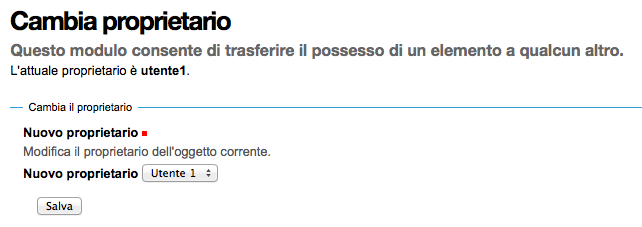

=======
I Ruoli
=======

La miglior definizione di "ruolo Plone" che posso trovare è questa:

    I ruoli sono un accorpamento di **permessi**.
    I ruoli sono direttamente associabili ai **poteri** di un utente nel sito.

Quando assegnate un ruolo ad un utente, state fornendo in realtà una serie di permessi (il vero
motore della sicurezza di Zope).
Come già detto in precedenza, *non potete in nessun modo assegnare permessi agli utenti* o ai
gruppi, ma potete solo assegnare ruoli.

Questa è una delle prime caratteristiche che fanno assaporare la potenza del sistema sottostante.
Prendiamo ad esempio in ruolo del **Lettore** (che verrà introdotto meglio in seguito).
cosa significhi essere un "lettore" non è qualcosa scritto nella roccia; siti diversi (e senza
dover per forza sviluppare del codice) possono differire dalla sua definizione, aumentando o
limitando i poteri (permessi) del ruolo.

I ruoli predefiniti
===================

Plone (e il framework Zope sottostante) forniscono una serie di ruoli predefiniti il cui
funzionamento è bene approfondire e comprendere.
Il motivo principale è che, sebbene sia possibile creare nuovi ruoli, l'eventualità di doverlo fare
è meno frequente di quanto si pensi (anche se non da escludere a priori).

I ruoli forniti di Zope
-----------------------

.. figure:: _static/zmi-security-zope-roles.png
   :alt: I ruoli di Zope

   *I quattro ruoli Zope, visti da ZMI*

I ruoli forniti da Zope sono quattro e non sono modificabili o eliminabili. Sulla loro presenza si
basa il funzionamento della sicurezza dell'application server, e quindi di Plone.

Anonimo (Anonymous)
~~~~~~~~~~~~~~~~~~~

**Anonimo** (**Anonymous**) è il ruolo assegnato agli utenti anonimi.
E' un ruolo speciale ed ha un comportamento diverso da tutti gli altri ruoli.
Non è infatti possibile definire un permesso accessibile dal ruolo Anonymous ma non da altri ruoli:
un potere dato ad un anonimo è di certo fornito anche a *qualunque* utente del sito.

Questo può sembrare scontato dal punto di vista logico, ma per gli altri ruoli può non essere così:
con altri ruoli sarebbe possibile disegnare una policy di sicurezza che assegni un permesso ad un
ruolo "poco importante" e non darlo ad un ruolo importante (un esempio: dare il permesso di vedere
un contenuto ad un *Collaboratore* del sito ma non al *Manager*. Possibile, anche se totalmente
illogico e sconsigliato).

Il ruolo Anonimo è per sua natura associato con il tipo di utente anonimo. Nel disegnare workflow
per i vostri contenuti questo ruolo assume parecchia importanza: un errore nell'assegnare un
permesso di troppo a questo utente e la sicurezza del vostro sito potrebbe essere compromessa.

Autenticato (Authenticated)
~~~~~~~~~~~~~~~~~~~~~~~~~~~

**Autenticato** (**Authenticated**) è il ruolo automaticamente assegnato ai visitatori del sito
che hanno eseguito un qualunque tipo di autenticazione, anche tramite `autenticazione basic`__ via
ZMI.

__ http://en.wikipedia.org/wiki/Basic_access_authentication

Un utente con ruolo *Autenticato* è quindi un utente a livello Zope.

Questo ruolo non è solitamente molto utilizzato nei workflow di Plone preferendovi, per
correttezza, il ruolo di *Collaboratore*.

Manager
~~~~~~~

L'Alpha e l'Omega dei ruoli. Chi ha ruolo **Manager** ha solitamente potere assoluto nel sito Plone
ed entra senza restrizioni in ZMI.

E' un ruolo ovviamente pericoloso e non va mai assegnato a sproposito. Come regola generale, se il
vostro utente *non ha* bisogno di accedere alla ZMI, *Manager* non è il ruolo migliore da
assegnargli ma va preferito il ruolo di *Amministratore del Sito*.

E' lecito avere installazioni di Plone dove esiste un solo utente con questo ruolo: **admin**,
l'utente predefinito a livello Zope che è di solito il creatore dei siti Plone.

Owner
~~~~~

Il concetto di **Possessore** (**Owner**), per quanto orribilmente tradotto in italiano, nasce a
livello Zope.
Un primo esempio: l'utente *admin* ha di solito il ruolo di *Owner* sull'"oggetto sito Plone"
poiché solitamente è questo utente che crea i nuovi siti all'interno del database di Zope.

E' un ruolo che va ben compreso:

* di solito deve essere assegnato ad un solo utente
* è possibile fornirlo a più utenti (ciò oggi è fortunatamente più difficile da farsi da
  interfaccia Plone, mentre in versioni precedenti del CMS era purtroppo un modo di operare molto
  comune).
* è possibile avere a che fare con workflow dove il *Possessore* non ha importanza (o sarebbe
  meglio non l'avesse).

Nella maggior parte dei casi è un ruolo che è direttamente associato con il creatore del contenuto.
Se "Utente 1" crea una pagina, Plone lo rende anche *Possessore* della pagina stessa.

Questo si può vedere anche dal campo "*Creatori*" comune a tutti i contenuti Plone, ma non bisogna
farsi trarre in inganno: il valore di questo campo è solo un'informazione testuale che può essere
facilmente modificata.

.. figure:: _static/edit-form-creators.png
   :alt: Metadato "Creatori"

   *La vista del campo "Creatori", nelle informazioni di "Possessore"*

Cambiando il valore di "Creatori" con un altro utente del sito non assegna il ruolo di *Possessore*
al nuovo utente specificato.
Il fatto che tale campo sia nell'insieme dei campi raggruppati sotto la sezione "*Proprietario*"
non fa altro che aumentare la confusione.

Le recenti versioni di Plone hanno reso più difficile assegnare questo ruolo a sproposito a più
utenti ma rimane possibile (e lecito) cambiare proprietario di un contenuto.

Esiste una vista speciale, raggiungibile solo conoscendone l'URL (una particolarità introdotta, a
mio parere per errore, in Plone 3): ``ownership_form``.
Questa vista va lanciata sul contesto del documento al quale si vuole cambiare proprietario e
permette di modificare l'utente che ha ruolo di *Possessore* sul contenuto.

   *La vista "change_ownership" lanciata su un contesto*

Esiste un comodissimo prodotto che permette di manipolare in blocco il ruolo di *Possessore* e
volendo anche il campo "Cratori" per più contenti del sito: `plone.app.changeownership`__.

__ http://plone.org/products/plone.app.changeownership

Quanto è importante il ruolo *Possessore*?
Dipende.

Nel momento della creazione di un contenuto questo ruolo ha di certo importanza, perché è ovvio che
la persona che sta salvando per la prima volta il documento deve avere i poteri di modifica.
Nel seguito invece la sua importanza dipende dal contesto.

Se state realizzando la sicurezza di un tipo di contenuto dove, per sua natura, il creatore è
importante (ad esempio: il contenuto rappresenta la prenotazione di un'auto aziendale) allora
il creatore continua ad avere una grande importanza per tutto il ciclo di vita del contenuto.

Se i poteri che un utente deve avere su un contenuto dipendono dal suo stato o dalla sua
appartenenza ad un gruppo allora il *dato* relativo al creatore può avere la sua importanza, ma la
persona che ha creato il contenuto no.

Un esempio: l'Utente 1 ha scritto un documento mentre lavorava per l'Ufficio 5. Poco importa chi
ha creato il documento, ma dopo la sua creazione l'utente non deve avere permessi particolari sul
contenuto, o di certo non deve continuare a mantenerli se in futuro lascerà l'Ufficio 5. 

.. Warning::
   Anche in questo caso i workflow base di Plone non sono ottimali

