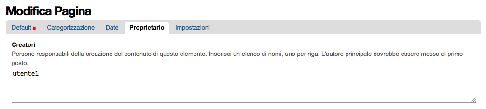
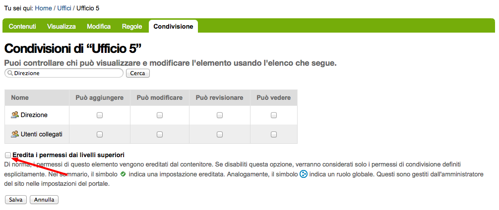
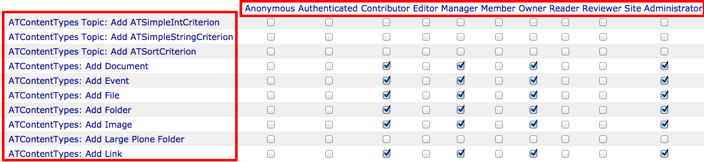
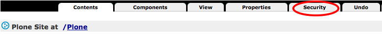
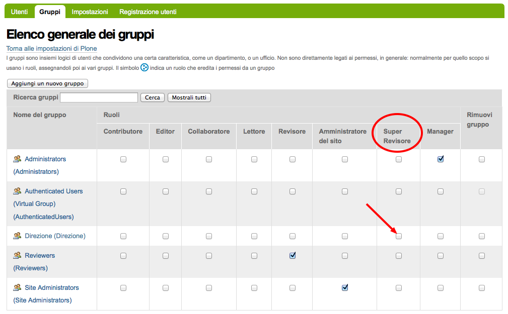

=======
I Ruoli
=======

.. only:: not latex

    .. contents:: Indice della sezione

La miglior definizione di "ruolo Plone" che posso trovare è questa:

    I ruoli sono un accorpamento di **permessi** e quindi rappresentano un insieme di **poteri**
    di un utente nel sito.

Quando assegnate un ruolo ad un utente, state fornendo in realtà una serie di permessi (il vero
motore della sicurezza di Zope).
Come già detto in precedenza, **non potete in nessun modo assegnare permessi agli utenti o ai
gruppi, ma potete solo assegnare ruoli**.

La funzionalità dei ruoli è una delle prime caratteristiche che fanno assaporare la potenza del
sistema sottostante.
Prendiamo ad esempio in ruolo del **Lettore** (che verrà introdotto meglio in seguito):
cosa significhi essere un "lettore" non è qualcosa scritto nella roccia; siti diversi (e senza
dover per forza sviluppare del codice) possono differire nella definizione aumentando o limitando i
poteri (permessi) del ruolo.

Va da se che il nome di un ruolo deve poter ricordare a chi lo andrà ad utilizzare il suo scopo.

I ruoli predefiniti
===================

Plone (e il framework Zope sottostante) forniscono una serie di ruoli predefiniti il cui
funzionamento è bene approfondire e comprendere.
Sebbene sia possibile creare nuovi ruoli l'eventualità di doverlo fare è meno frequente di quanto
si pensi (anche se non da escludere a priori).

.. Warning::
    Uno errore molto comune nelle applicazioni Plone mal scritte è definire una grande serie di
    nuovi ruoli. **Più ruoli aggiungete più complesso diventa gestire la sicurezza del sito**.

I ruoli forniti di Zope
-----------------------

.. figure:: _static/zmi-security-zope-roles.png
   :alt: I ruoli di Zope

   *I quattro ruoli Zope, visti da ZMI*

I ruoli forniti da Zope sono quattro e non sono modificabili o eliminabili. Sulla loro presenza si
basa il funzionamento della sicurezza dell'application server, e quindi di Plone.

Anonimo (Anonymous)
~~~~~~~~~~~~~~~~~~~

**Anonimo** (**Anonymous**) è il ruolo assegnato agli utenti anonimi.
E' un ruolo speciale ed ha un comportamento diverso da tutti gli altri ruoli.
Non è infatti possibile definire un permesso accessibile dal ruolo Anonymous ma non da altri ruoli:
un potere dato ad un anonimo è di certo fornito anche a *qualunque* utente del sito.

Il ruolo Anonimo è per sua natura associato con il tipo di utente anonimo. Nel disegnare workflow
per i vostri contenuti questo ruolo assume parecchia importanza: un errore nell'assegnare un
permesso di troppo a questo utente e la sicurezza del vostro sito potrebbe essere compromessa.

Autenticato (Authenticated)
~~~~~~~~~~~~~~~~~~~~~~~~~~~

**Autenticato** (**Authenticated**) è il ruolo automaticamente assegnato ai visitatori del sito
che hanno eseguito un qualunque tipo di autenticazione, anche tramite `autenticazione basic`__ via
ZMI.

__ http://en.wikipedia.org/wiki/Basic_access_authentication

Un utente con ruolo *Autenticato* è quindi un utente a livello Zope.

Questo ruolo non è solitamente molto utilizzato nei workflow di Plone preferendovi, per
correttezza, il ruolo di *Collaboratore*.

Manager
~~~~~~~

L'Alpha e l'Omega dei ruoli. Chi ha ruolo **Manager** ha solitamente potere assoluto nel sito Plone
ed entra senza restrizioni in ZMI.

E' un ruolo ovviamente pericoloso e non va mai assegnato a sproposito. Come regola generale, se il
vostro utente *non ha* bisogno di accedere alla ZMI, *Manager* non è il ruolo migliore da
assegnargli ma va preferito il ruolo di *Amministratore del Sito*.

E' lecito avere installazioni di Plone dove esiste un solo utente con questo ruolo: **admin**,
l'utente predefinito a livello Zope che è di solito il creatore dei siti Plone.

.. Note::
    A differenza del ruolo *Anonimo* (il ruolo con meno poteri), la sua natura di essere il
    ruolo "con i super poteri" non è predeterminata.
    
    Un esempio: sarebbe possibile dare il permesso di vedere un contenuto ad un *Collaboratore* del
    sito ma non al *Manager*.
    Questo è possibile, anche se totalmente illogico e sconsigliato.
    Il *Manager*, avendo poi accesso alla ZMI e quindi al sistema di associazione di ruoli e
    permessi, potrebbe poi ri-assegnarsi il permesso mancante.

Possessore (Owner)
~~~~~~~~~~~~~~~~~~

Il concetto di **Possessore** (**Owner**), per quanto orribilmente tradotto in italiano, nasce a
livello Zope.
Un primo esempio: l'utente *admin* ha di solito il ruolo di *Owner* sull'"oggetto sito Plone"
poiché solitamente è questo utente che crea i nuovi siti all'interno del database di Zope.

E' un ruolo che va ben compreso:

* di solito deve essere assegnato ad un solo utente
* è possibile fornirlo a più utenti (ciò oggi è fortunatamente più difficile da farsi da
  interfaccia Plone, mentre in versioni precedenti del CMS era purtroppo un modo di operare molto
  comune) ma bisogna essere certi di che cosa si sta facendo
* è possibile avere a che fare con workflow dove il *Possessore* non ha importanza (o sarebbe
  meglio non l'avesse)

In una configurazione base, un *Possessore* mantiene un certo livello di potere sui propri
contenuti.
Detto in poche parole: può modificarli e poi sottoportli a revisione (ma questo dipende molto dal
workflow).

Possessore e Creatore
_____________________

Nella maggior parte dei casi è un ruolo che è direttamente associato con il creatore del contenuto.
Se "Utente 1" crea una pagina, Plone lo rende anche *Possessore* della pagina stessa.

Questo si può vedere anche dal campo "*Creatori*" comune a tutti i contenuti Plone, ma non bisogna
farsi trarre in inganno: il valore di questo campo è solo un'informazione testuale che può essere
facilmente modificata.

   *La vista del campo "Creatori", nelle informazioni di "Possessore"*

Cambiando il valore di "Creatori" con un altro utente del sito non assegna il ruolo di *Possessore*
al nuovo utente specificato.
Il fatto che tale campo sia nell'insieme dei campi raggruppati sotto la sezione "*Proprietario*"
non fa altro che aumentare la confusione.

Cambiare Possessore di un contenuto è possibile
_______________________________________________

Le recenti versioni di Plone hanno reso più difficile assegnare questo ruolo a sproposito a più
utenti ma rimane possibile (e lecito) cambiare proprietario di un contenuto.

Esiste una vista speciale, raggiungibile solo conoscendone l'URL (una particolarità introdotta, a
mio parere per errore, in Plone 3): ``ownership_form``.
Questa vista va lanciata sul contesto del documento al quale si vuole cambiare proprietario e
permette di modificare l'utente che ha ruolo di *Possessore* sul contenuto.

.. figure:: _static/change_ownership.png
   :alt: Vista "change_ownership"

   *La vista "change_ownership" lanciata su un contesto*

Esiste un comodissimo prodotto che permette di manipolare in blocco il ruolo di *Possessore* e
volendo anche il campo "Cratori" per più contenti del sito: `plone.app.changeownership`__.

__ http://plone.org/products/plone.app.changeownership

Quanto è importante il ruolo Possessore?
________________________________________

Dipende.

Nel momento della creazione di un contenuto questo ruolo ha di certo importanza, poiché ovviamente
l'utente che sta salvando per la prima volta il documento deve avere i poteri di modifica.
Nel seguito invece la sua importanza dipende dalla natura del vostro sito.

Se state realizzando la sicurezza di un tipo di contenuto dove, per sua natura, il creatore è
importante (ad esempio: il contenuto rappresenta la prenotazione di un'auto aziendale) allora
il creatore continua ad avere una grande importanza per tutto il ciclo di vita del contenuto.

Se i poteri che un utente deve avere su un contenuto dipendono dal suo stato o dalla sua
appartenenza ad un gruppo allora il *dato* relativo al creatore può avere la sua importanza, ma la
persona che ha creato il contenuto no.

Un esempio: l'Utente 1 ha scritto un documento mentre lavorava per l'Ufficio 5. Poco importa chi
ha creato il documento, ma dopo la sua creazione l'utente non deve avere permessi particolari sul
contenuto, o di certo non deve continuare a mantenerli se in futuro lascerà l'Ufficio 5. 

.. Warning::
   Anche in questo caso i workflow base di Plone non sono ottimali per tutte le situazioni.

Se volete maggiori dettagli su questo argomento, l'ho affrontato lungamente nel mio articolo
`Plone, security and workflows: when rely on Owner role is bad`__ (in lingua inglese).

__ http://blog.keul.it/2011/09/plone-security-and-workflows-when-rely.html

I ruoli definiti da Plone
-------------------------

Plone è un'applicazione costruita sull'application server Zope.
Per raggiungere i suoi scopi esso definisce di partenza alcuni ruoli aggiuntivi.

La differenza principale con i ruoli di Zope visti alla sezione precedente è che questi ruoli *non*
sono necessari per il funzionamento di Zope (e in realtà nemmeno di Plone).

Plone dà alcuni "suggerimenti" su una configurazione ottimale, non troppo semplice né troppo
complessa.
I ruoli forniti di Plone sono ottimi per la maggior parte delle configurazioni e permettono di
avere un minimo meccanismo di revisione e una buona suddivisione delle competenze.

Contributore (Contributor)
~~~~~~~~~~~~~~~~~~~~~~~~~~

Il **Contributore** (un altro ruolo la cui traduzione ufficiale italiana lascia a desiderare) è la
persona che "porta contributi al sito".
Una traduzione migliore sarebbe probabilmente quella di *Autore* o *Redattore*.

Il *Contributore* è una persona che può inserire nuovi contenuti nel sito.
Nella configurazione predefinita di Plone, questo include i permessi per inserire *tutti* i
contenuti (ad esclusione delle **Collezioni**).

Il Contributore può modificare i propri contenuti?
__________________________________________________

Nella configurazione iniziale di Plone, la risposta è sì.

Questo potere però non dipende dal ruolo di *Contributore* stesso e dai suoi poteri ma dal fatto
che un utente che crea un contenuto ne diventa *Possessore*.

Questo concetto è molto importante.

Editor
~~~~~~

L'**Editor** è un utente che ha poteri di *modifica* sui contenuti.
E qui ci si ferma!

Un *Editor* può modificare quindi *tutti* i contenuti su cui ha potere, ma non è nella sua natura
creare nuovi contenuti.

Nella mia idea di sito un editor deve poter aggiungere *e* modificare
_____________________________________________________________________

Non siete gli unici.
Questo in Plone può essere fatto in due modi.

Il primo sarebbe quello di modificare i poteri del ruolo *Editor* per fornirgli anche i poteri
del *Contributore*.
Il modo che però consiglio è quello di **assegnare al vostro utente due ruoli**: il ruolo di
*Editor* e **Contributore**.

Editor e le Collezioni
______________________

Un editor può modificare anche le collezioni (che un *Contributore* non potrebbe normalmente
creare.
Questa particolarità non è ben giustificabile e credo crei un po' di confusione (ad ogni modo: è
solo una configurazione di base, che può essere facilmente modificata).

Per di più: prima di Plone 4.2 (con le vecchie collezioni) la modifica si limitava ai soli campi
del "contenuto collezione" ma non ai criteri, che comparivano in un'altro tab; nelle nuove
collezioni chi può modificare una collezione ha potere anche sui criteri.

.. figure:: _static/criterion-tab-old-collections.png
   :alt: Il tab "Criteri"

   *Come si presenta il tab dei "Criteri" nei cercatori vecchio stile*

Il motivo sarà discusso in seguito nel
:ref:`capitolo dei permessi <section-permissions-old-topic>`.

Collaboratore (Member)
~~~~~~~~~~~~~~~~~~~~~~

Il **Collaboratore** è l'utente autenticato nella concezione di Plone (che si distingue dal ruolo
di *Autenticato* definito da Zope, visto in precedenza).

La presenza di questo doppio ruolo crea qualche confusione.
Di base questo ruolo viene fornito automaticamente a tutti gli utenti del sito, come *ruolo
globale*.

   *Il ruolo "Collaboratore" dato a tutti gli utenti* 

Il *Collaboratore* non è un ruolo speciale.
Basi dati utente aggiuntive (LDAP, RDBMS) di solito forniscono questo stesso ruolo automaticamente.
In pratica quando si vogliono dare poteri agli utenti autenticati nel sito Plone bisogna riferirsi
a questo ruolo, che va preferito al ruolo *Autenticato* visto in precedenza. 

Cosa succede se un utente non è Collaboratore?
______________________________________________

Per quanto detto dell'*Autenticato* e del *Collaboratore* si può concludere che *è possibile* avere
utenti del sito sprovvisti del ruolo *Collaboratore* (non è possibile il contrario invece).

Plone continua a funzionare a dovere (ci sono in effetti piccole differenze, funzionalità che in
questa configurazione avrebbe solo il *Collaboratore*).

Può servire una simile impostazione?
In effetti sarebbe possibile definire in questo modo utenti del sito di primo e di secondo livello,
dove gli utenti con ruolo *Autenticato* hanno minori poteri.

Tenete sempre presente che si sta comunque parlando di due ruoli di basso livello (non creano
contenuti, non gestiscono documenti, ...).

La possibilità c'è.

Lettore (Reader)
~~~~~~~~~~~~~~~~

Nel significato che Plone dà al ruolo **Lettore** c'è il poter "vedere", che si traduce (di base)
in poter accedere a contenuti normalmente non visibili.
Va usato per assegnare ad utenti del sito un'anteprima di un lavoro in corso o l'accesso permanente
ad un'area privata.
Tutto questo senza fornire poteri di modifica di nessun tipo.

Il lettore è un ruolo interessante ed utile, ma non è detto che sia necessario nel vostro portale.
Dal punto di vista della "scala dei poteri" questo ruolo è appena sopra la coppia
*Autenticato*/*Collaboratore*.

Revisore (Reviewer)
~~~~~~~~~~~~~~~~~~~

Il **Revisore** assume importanza solo in presenza di un processo di pubblicazione.
Il *Revisore* normalmente non crea contenuti ma lavora sui contenuti altrui: li revisiona.

Ha di solito il potere di accettare il lavoro svolto (di solito: la richiesta di pubblicazione)
o rifiutarlo: agisce sul **worfklow**. 

Un altro potere che (normalmente) gli viene assegnato è la **gestione delle parole chiave**.

Anche questo ruolo potrebbe non servire nel vostro sito: come tutto in Plone, dipende dal vostro
ambiente e dai vostri scopi.

Amministratore del sito (Site Administrator)
~~~~~~~~~~~~~~~~~~~~~~~~~~~~~~~~~~~~~~~~~~~~

Questo ruolo è stato introdotto con Plone 4.1, e per ottimi motivi.
Il suo scopo e dare poteri assoluti agli utenti Plone, senza dar loro poteri definiti "di
programmazione" (che si traduce normalmente con l'accesso alla ZMI).

Di questo ruolo se ne sentiva la mancanza.
E' normale che il vostro cliente, l'azienda che vi a commissionato un'applicazione basata su Plone
voglia avere utenti con "poteri assoluti" (per l'appunto gli "amministratori del sito").

Il problema un tempo era non dare poteri inutilmente pericolosi:
Alla ZMI deve avere accesso solo un utente che ne abbia effettivamente bisogno.

.. _section-roles-site-administrator-notes:

Attualmente: un ruolo poco supportato
_____________________________________

Spero che questo paragrafo diventi velocemente deprecato ma al momento le cose vanno così: molti
prodotti vengono aggiornati senza fornire supporto al ruolo *Amministratore del sito*, oppure
basandosi su permessi che questo ruolo non ha (ma che invece ha il *Manager*).
Vedere la descrizione del permesso ":ref:`section-permissions-manage-portal`".

Col tempo andrà meglio.

Come usare i ruoli
==================

I ruoli globali
---------------

Il modo più facile per gestire i ruoli è direttamente dalla gestione "Utenti e gruppi".
Da queste pagine infatti è possibile vedere tutti i ruoli ed è la prima cosa che un amministratore
vede dopo aver aggiunto un utente o creato un gruppo.

   *La visione dei ruoli globali dal pannello di controllo degli utenti*

Questa "facilità" di lavoro trae in inganno e fa sì che gli amministratori *credano* che queste
pagine siano il modo giusto di procedere.

    **No!** Evitate i ruoli globali.

I ruoli globali sono dannosi perché molto spesso nascondono una tra le più grandi funzionalità di
Plone: **la condivisione di un contenuto o una sezione del sito**.

Per di più, i ruoli globali sono **assoluti** e non possono in nessun modo essere bloccati.
Questo significa che se assegnate un ruolo globale ad un utente o un gruppo, quell'utente o gruppo
avrà il potere assegnatogli in tutto il sito, senza eccezioni.

Per concludere: sconsiglio di usare i ruoli globali, soprattutto per i singoli utenti.

Eccezioni utili
~~~~~~~~~~~~~~~

Le eccezioni ci sono.

La prima eccezione è per l'assegnazione del ruolo di *Collaboratore* agli utenti, che in una
configurazione normale diventa appunto una proprietà dell'utente che non ha limitazioni in nessuna
sezione del sito: un utente del sito è utente del sito ovunque (nota bene: questo non significa che
l'utente debba avere accesso a tutte le aree del sito).

La seconda eccezione vale per alcuni gruppi, come indicato quando si sono presentati i gruppi
predefiniti di Plone.
Ci sono alcuni gruppi che, per natura, definiscono poteri globali: l'ipotetico gruppo dei
"Redattori Ufficio 5" non deve probabilmente avere nessun potere globale, ma per un gruppo come gli
Amministratori del Sito la cosa è diversa.

L'unica eccezione che sconsiglio sempre è l'assegnazione di altri poteri che non siano quelli di
*Collaboratore* a qualunque utente.
Se ci possono essere eccezioni per i gruppi, per gli utenti no. Consiglio piuttosto di creare un
gruppo dove porre questo utente e dare i poteri al gruppo.

I ruoli locali (condivisione)
-----------------------------

Il modo che consiglio per gestire l'assegnazioni dei ruoli nel vostro sito è il pannello della
condivisione.
Proseguiamo l'esempio mostrando la condivisione di una cartella del sito che dovrebbe essere l'area
di lavoro dell'"Ufficio 5", all'interno di una macro-area che racchiude tutti gli uffici.

.. figure:: _static/sharing-view.png
   :alt: Condivisione

   *La vista della condivisione di un elemento*

Fate particolare attenzione alle *briciole di pane* (breadcrumbs), che ci permettono sempre di
comprendere la nostra posizione all'interno del sito.

La descrizione "*Puoi controllare chi può visualizzare e modificare l'elemento usando l'elenco che
segue.*" che leggete nell'immagine, di certo facilita a comprendere che cosa si può fare in questa
vista ma è limitativa perché vale solo per la configurazione base di Plone.

Nella realtà da questo modulo si possono controllare tutti i ruoli, anche quelli non compresi in
una installazione base.

Il pannello della condivisione mostra sempre una tabella riassuntiva sullo stato dei ruoli
assegnati nel contesto.
La lista può anche essere inizialmente vuota ma si popola automaticamente in presenza di
impostazioni di condivisione, oppure non appena l'utente usa il campo di ricerca utenti e gruppi.

A questo punto l'utente che ha accesso a questo modulo può assegnare permessi semplicemente
selezionando le caselle di spunta disponibili.

Come avrete notato, non tutte le spunte sono sempre attive, ma vengono a volte sostituite da icone.
Il testo di aiuto in basso è molto utile a comprendere perché alcune spunte possono essere
inattive.

I **ruoli globali** (|global_role_icon|) sono quelli discussi alla sezione precedente. Se un dato
utente o gruppo ha dei ruoli globali non avrebbe nessun effetto poter assegnare quello stesso ruolo
anche nel contesto corrente, quindi l'azione è disabilitata.

I **ruoli ereditati** (|inherit_role_icon|) verranno discussi meglio tra poco.

.. |inherit_role_icon| image:: _static/inherit_role_icon.png
                       :align: bottom

Ereditarietà dei ruoli locali
~~~~~~~~~~~~~~~~~~~~~~~~~~~~~

I ruoli assegnati agli utenti in Plone vengono di norma ereditati.
Questo permette di fornire ruoli locali ad utenti in una sezione e (ovviamente) avere questi stessi
ruoli in tutto il sottoalbero.

Nell'esempio di poco fa, il gruppo "*Direzione*" all'interno della cartella "*Ufficio 5*" ha un
ruolo ereditato da un qualche livello superiore.
Non possiamo sapere da questa pagina da quale livello si ottenga questa ereditarietà; la logica ci
dice che molto probabilmente il gruppo ha un ruolo assegnato nella cartella padre (*Uffici*) ma
questo non è importante.

Anche in questo caso, come succede per i ruoli globali, il controllo per assegnare il ruolo può
essere inaccessibile e sostituito da un'icona, e questo per lo stesso motivo: non avrebbe effetto
assegnare lo stesso ruolo ad un utente o un gruppo che già lo possiede per effetto
dell'ereditarietà

C'è però un comportamento molto interessante, che è il motivo scatenante per cui consiglio i ruoli
locali a discapito dei ruoli globali: i ruoli locali possono essere bloccati.

   *La vista della condivisione di un elemento con blocco dell'ereditarietà dei ruoli*

La spunta "*Eredita i permessi dai livelli superiori*" ha proprio l'effetto descritto: se viene
rimossa si viene ad annullare l'ereditarietà dei ruoli *locali* (e non globali) da un qualunque
livello superiore.

A questo punto il gruppo "*Direzione*" diventa un gruppo come gli altri.
Potremmo anche ri-assegnare lo stesso potere che aveva prima del blocco dell'ereditarietà e non
sarebbe nemmeno un comportamento tanto bizzarro (perché magari era nel nostro interesse che il
gruppo non avesse quel ruolo in altri uffici, ma non in questo).

Il blocco dell'ereditarietà permette di creare sezioni protette all'interno di aree del sito:

* una cartella altamente riservata, invisibile e inaccessibile a tutti gli utenti a cui abbiamo
  dato poter di poter vedere la nostra sezione della intranet
* un documento in sola lettura che nessun utente con potere di modificare possa toccare
* una sezione dove gli amministratori del sito posizionano documentazione relativa ad un gruppo
  di persone, ma non accessibile al gruppo stesso

Condivisione del documento predefinito
~~~~~~~~~~~~~~~~~~~~~~~~~~~~~~~~~~~~~~

Un errore comune è quello di finire erroneamente nella condivisione di un documento usato come
vista predefinita di una cartella e non nella cartella stessa.

Visto che nel 90% dei casi questo è un errore, Plone ci avverte del problema con un messaggio.

   *Il messaggio di avvertimento in caso di condivisione dei permessi su una pagina predefinita*

Questo comportamento potrebbe anche diventare un'opportunità, probabilmente legata al blocco dei
ruoli locali descritti poco fa.

Ruoli locali come fossero globali
---------------------------------

Verrà ora descritto come poter avere nel proprio sito Plone lo stesso comportamento relativo ai
ruoli globali pur mantenendo la possibilità di bloccare l'ereditarietà.

Quello che basta fare è usare la condivisione di Plone sulla radice del sito (come descritto alla
sezione precedente: fate attenzione a non essere finiti in condivisione della pagina predefinita
del sito).
In questo modo avete il meglio dei due mondi:

* I ruoli sono assegnati ad utenti o gruppi in tutto il sito
* In qualunque momento potete bloccare l'ereditarietà dei ruoli in specifiche sezioni del sito

La "traduzione" dei ruoli locali
--------------------------------

Fin'ora non abbiamo accennato nulla sul fatto che sembra esserci una grande differenza tra che
cosa viene visualizzato nella gestione dei ruoli globali e cosa invece nella vista di condivisione
per assegnare ruoli locali.

Avrete già notato come nella configurazione del sito vengano mostrati quasi tutti i ruoli che
sono stati descritti nella relativa sezione.
Sono esclusi tutti i ruoli definiti da Zope tranne *Manager* ma sono inclusi tutti i ruoli definiti
a livello Plone.
Questa vista ha quindi la particolarità di **mostrare automaticamente i nuovi ruoli** che potreste
andare a definire.

   *I ruoli globali, come sono presentati dalla gestione utenti e gruppi*

Lo stesso non succede per la vista di condivisione, dove potrebbe addittura sembrare che non siano
mostrati *ruoli* ma *permessi*.

   *I ruoli locali, come sono presentati dalla vista condivisione*

In realtà questo non è vero.
Sempre per semplificare la vista agli utenti che si avvicinano a Plone per la prima volta e per
aumentare l'usabilità della pagina, dalla versione 3 di Plone la condivisione è stata modificata
nel seguente modo:

* non mostra tutti i ruoli, ma solo quelli realmente utili per eseguire la condivisione
* non mostra i nomi dei ruoli, ma una generica descrizione di "cosa il ruolo fa"

Quindi:

* "**Può aggiungere**" è per il "*Contributore*"
* "**Può modificare**" è per "*Editor*"
* "**Può revisionare**" è per il "*Revisore*"
* "**Può vedere**" è per il "*Lettore*"

Rimane quindi sempre valida la regola: in Plone si assegnano ruoli, non permessi.

Quando non assegnare inutilmente ruoli
--------------------------------------

C'è un comportamento scorretto piuttosto comune che ho potuto vedere spesso (che si parli di ruoli
globali o locali).
Si ha la necessità di dare "*tutti i permessi*" (qualunque cosa significhi, ma è una frase
ricorrente) ad un utente in una certa sezione e pigramente si sceglie di "*selezionare tutto*",
ossia assegnare all'utente tutti i permessi possibili... e non pensarci più.

Va invece tenuto presente che alcuni ruoli, per loro natura, "incapsulano" i poteri di altri ruoli.
Nella configurazione base di Plone il problema si presenta spesso col ruolo *Lettore*.

E' inutile assegnare ad un utente il permesso di *Lettore* se questo utente possiede già uno di
altri ruoli quali *Contributore*, *Revisore* o *Editor* poiché questi ruoli per loro natura
possiedono già i poteri del *Lettore*.

Ovviamente questo potrebbe non essere vero in presenza di modifiche ai workflow o con workflow
particolari.

Creare nuovi ruoli: quando e perché
===================================

Nelle recenti versioni di Plone la necessità di avere nuovi ruoli è venuta largamente meno.
Tutti le figure utili per quello che può essere un semplice sito, un enorme portale o una complessa
intranet aziendale, sono forniti dall'installazione base di Plone.

Perché creare ruoli aggiuntivi è sconsigliato
---------------------------------------------

    La creazione di nuovi ruoli complica i workflow e la gestione dei permessi

Non si sono ancora affrontati i **workflow** o i **permessi** ma anticipiamo qualche cosa.
Per ogni ruolo esistente in un sito Plone va considerato il suo effetto per ogni permesso e questo
crea una specie di matrice (una tabella).
Non c'è bisogno di immaginare questa tabella poiché esiste davvero.

   *Un'anteprima parziale della vista della sicurezza in ZMI*

Nell'immagine sopra troviamo in riga i permessi del sito (sono solo una piccola parte e non
scenderemo nei dettagli per ora) e in colonna i ruoli.
Potete ben immaginare che più la tabella diventa grande, più è difficile da gestire ma non ci è
davvero possibile limitare i permessi (o solo in minima parte).
Un'installazione base di Plone ha comunque un numero enorme di permessi, quindi dobbiamo
rassegnarci ad avere una tabella con tantissime righe.

Capite quindi che aggiungere una colonna a questa tabella aumenta di molto il numero di permessi da
gestire per questo ruolo.
Nella maggior parte dei casi il valore predefinito del permesso andrà bene, ma particolare
attenzione andrà ai permessi che sono poi gestiti tramite workflow... e questo ci obbliga anche a
verificare i permessi gestiti dai workflow... per ogni stato.

Se tutto questo non sembra ancora abbastanza chiaro, le cose miglioreranno dopo aver letto i
rispettivi capitoli sui **permessi** e **workflow**.

Un altro motivo sono i **prodotti aggiuntivi**.
E' lecito pensare che la vostra installazione Plone utilizzerà alcuni tra le centinaia di add-on
disponibili.
I prodotti aggiuntivi non conoscono i vostri ruoli e contemporaneamente è possibile che aggiungano
al vostro sito nuovi permessi; il prodotto quindi si prenderà in carico di configurare alcune
impostazioni di sicurezza al momento dell'installazione.

Quali, se non i ruoli predefiniti, saranno presi in considerazione?
Ecco perché molto spesso è meglio cambiare i poteri di un ruolo esistente piuttosto che crearne uno
nuovo.

Quando *non* serve un nuovo ruolo
---------------------------------

Molto spesso si crede che nel proprio sito Plone serva un nuovo ruolo quando invece serve una
modifica ad un qualche workflow o alla sicurezza.

Il problema principale è che **creare nuovi ruoli è facile**, mentre modificare i workflow è una
cosa più complessa; alle volte la scelta sbagliata viene presa per pigrizia.

Non è detto serva un nuovo ruolo Plone se serve che un utente debba fare "qualcosa di nuovo".

Per semplicità seguono tre esempi di casi in cui *non* serve un nuovo ruolo.

Non serve un nuovo ruolo se... 1
~~~~~~~~~~~~~~~~~~~~~~~~~~~~~~~~

Plone ti fornisce il ruolo di *Contributore* e *Editor* ma la tua installazione è semplice e senza
fronzoli: i tuoi utenti devono poter creare contenuti e modificare quelli di tutti. Chiamiamolo
*Redattore*.

La soluzione: dare entrambi i ruoli ai tuoi utenti.

Non serve un nuovo ruolo se... 2
~~~~~~~~~~~~~~~~~~~~~~~~~~~~~~~~

Hai appena installato `Ploneboard`__ e vuoi un nuovo ruolo che ti permetta di gestire i commenti:
il *Moderatore*.

__ http://plone.org/products/ploneboard

La soluzione: il moderatore non sarebbe più o meno il *Revisore* dell'area forum?
Perché quindi non usare quel ruolo?

Quello che in questo caso ti serve è una modifica al workflow del forum o dei commenti e
l'assegnazione di ruoli locali ai giusti utenti nell'area forum (bloccando ovviamente eventuali
altri revisori del sito).

Non serve un nuovo ruolo se... 3
~~~~~~~~~~~~~~~~~~~~~~~~~~~~~~~~

Hai una speciale sezione del sito dove una nuova super razza *Revisori* non solo devono essere in
grado di revisionare i contenuti, ma anche di modificarli: il "*Super Revisore*".

La soluzione: se in quella sezione hai bisogno che tutti i *Revisori* diventino *Super Revisori*,
allora quello che ti serve è semplicemente un nuovo workflow, e probabilmente installare il
*supporto per le politiche di workflow* (o `CMFPlacefulWorkflow`__, presente nelle installazioni
Plone ma di base non attivato).

__ http://pypi.python.org/pypi/Products.CMFPlacefulWorkflow

Quando serve un nuovo ruolo
---------------------------

La creazione di nuovi ruoli è scoraggiata ma è inevitabile in vari casi.

    Un ruolo ruolo diventa necessario quando un utente deve poter fare qualcosa che nessun altro
    ruolo (o combinazione di ruoli) sia in grado di fare in quel contesto.

Ricolleghiamoci all'ultimo caso appena affrontato (l'ipotesi del *Super Revisore*).

Se in quella speciale area del sito la richiesta fosse stata di mantenere *anche* il ruolo di
*Revisore* (col suo funzionamento predefinito, accettare/rifiutare i contenuti), allora il *Super
Revisore* (che in più modifica) sarebbe stato per forza un nuovo ruolo.

In presenza di una simile richiesta c'è poco da fare, se non tentare di far ragionare il
committente, chiedergli se *davvero* c'è la necessità di una simile presenza di due diverse figure
di revisori.

Seguono tre esempi di casi in cui la creazione di un nuovo ruolo è inevitabile.
Sono tutti e tre casi reali (decontestualizzati) che ho potuto vedere in questi anni.

Serve un nuovo ruolo se... 1
~~~~~~~~~~~~~~~~~~~~~~~~~~~~

Hai necessità di un meccanismo di revisione a due livelli: il normale *Revisore* approva i
contenuti ma una seconda figura ha voce in capitolo per un'approvazione di secondo livello.

Serve un nuovo ruolo se... 2
~~~~~~~~~~~~~~~~~~~~~~~~~~~~

Ti viene chiesto che un certo gruppo di utenti debba poter gestire le portlet (riquadri) del sito.

Le portlet sono un'attività ad oggi sotto il controllo dei *Manager* e degli
*Amministratori del Sito* e, a meno che la richiesta non sia di dare questo potere a tutti i
*Revisori* del sito, l'unica soluzione è creare un ruolo di *Gestore portlet*.

Serve un nuovo ruolo se... 3
~~~~~~~~~~~~~~~~~~~~~~~~~~~~

La tua installazione Plone è in realtà un applicativo di gestione ordini (diciamo un DMS), dove in
poche cartelle sono contenute decine di migliaia di ordini di acquisto.
In più l'azienda che utilizza l'applicativo ha un enorme numero di ruoli interni e tutti devono
mettere voce nell'approvazione dell'ordine per passare dalla sua fase iniziale all'evasione finale.

In questo caso siamo in presenza di una struttura del sito molto semplice ma anche di un
organigramma molto complesso.
L'unica soluzione è davvero quella di creare tutti i ruoli necessari.

Come creare nuovi ruoli
=======================

.. Warning::
    Quando segue, sebbene sia una descrizione di come creare nuovi ruoli tramite ZMI, non è
    solitamente il comportamento corretto da tenere, soprattutto se si ha accesso al server dove
    è installato Plone e si ha possibilità quindi di poter aggiungere prodotti.
    
    Per replicare la creazione di un nuovo ruolo con un prodotto, vedere la sezione
    :ref:`section-product-add-new-role`.

La creazione di nuovi ruoli è semplice, basta accedere alla ZMI del proprio sito Plone alla
gestione della sicurezza (scheda **security**) il che ci porta alla pagina ``/manage_access``.

   *Link per andare alla gestione della sicurezza del sito Plone, da ZMI*

In fondo a questa pagina trovare il **form per aggiungere nuovi ruoli** (ed eliminarli).

   *Form per la creazione di nuovi ruoli dalla gestione della sicurezza del sito Plone, da ZMI*

Basta scegliere un nome per il nostro ruolo e premere *Add Role*.
Immediatamente possiamo vederne gli effetti nella pagina stessa.

   *Il nuovo ruolo appena creato, inserito tra le colonne della matrice*

Comportamenti di un ruolo appena creato
---------------------------------------

Quando viene creato un nuovo ruolo, Plone non sa come gestirlo, quindi non gli viene assegnato
nessun permesso (la colonna dei checkbox sarà inizialmente vuota).
Sta a voi passare in rassegna tutti i permessi e fornire al ruolo tutti i permessi necessari,
tenendo presente che:

* alcuni permessi potrebbero essere gestiti dai workflow
* gli utenti potrebbero avere altri ruoli oltre al nuovo venuto

Date al ruolo il minor numero di permessi possibile, concentratevi su quello che il ruolo dovrà
fare.

Manteniamoci sull'esempio proposto in precedenza: il *Super Revisore* deve avere gli stessi poteri
del *Revisore* ma poter modificare i contenuti pubblicati.
Il primo passo sarà quello di copiare *tutti* i permessi associati al ruolo di *Revisore*, poi
concentrarsi sulle differenze.
Per poter modificare i documenti pubblicati sarà necessario lavorare col workflow.

    Non assegnate altri permessi se non sono necessari.

Assegnare il nuovo ruolo
------------------------

Lasciamo la ZMI e torniamo all'interfaccia di Plone.

Come fatto in precedenza, partiamo dalla gestione utenti e gruppi del sito.

   *Il nuovo ruolo appena creato, visto dalla gestione utenti e gruppi di Plone*

In questo caso possiamo vedere la facilità con cui saremmo in grado di assegnare questo ruolo in
modo globale.
Come già discusso, questo può essere giusto o sbagliato; magari nel vostro sito il gruppo
**Direzione** deve possedere questo ruolo in modo globale e senza eccezioni e sarebbe quindi giusto
fornirgli questo ruolo da questa pagina.

L'esempio con cui abbiamo introdotto il concetto di *Super Revisore* parlava però di una specifica
cartella del sito dove questi utenti dovevano poter lavorare (ammettiamo che questo avvenga nella
cartella *News*).
Per ottenere questo avrete capito che si sta invece parlando di ruoli locali, quindi andiamo a
condividere il nuovo ruolo su quella cartella.

   *Dalla condivisione della cartella "News" manca il nuovo ruolo appena definito*

Che succede?
Avremmo bisogno di vedere il nuovo ruolo nella condivisione ma questo non compare!

Avevamo detto in precedenza come la condivisione non mostra tutti i ruoli, ma solo quelli realmente
utili al funzionamento della convisidione di Plone.
Il problema ora è che il nostro ruolo *dovrebbe* comparire in questa lista e siamo quindi costretti
a dire esplicitamente a Plone di voler inserire il nuovo ruolo.

Per fare questo purtroppo dobbiamo per la prima volta sporcarci davvero le mani con qualche riga di
codice.

.. Note::
    
    Ad oggi non c'è nessun modo di scegliere da interfaccia Plone o ZMI quali ruoli mostrare nella
    pagina della condivisione.
    
    Questo viene ottenuto in modo piuttosto semplice, utilizzando uno dei passi di un profilo di
    *Generic Setup* (che si occupa ri gesitrare per noi una *local utility*).

Mostrare i nuovi ruoli nella condivisione
-----------------------------------------

La prima domanda che probabilmente ci si porrà: dove inserire il codice?

Il codice di Plone, quando non fa parte del core, va in prodotti aggiuntivi. Non è necessario siano
uno dei prodotti `liberamente scaricabili dal sito ufficiale`__, ma può essere un vostro prodotto
ad uso interno.

__ http://plone.org/products/

In quale prodotto inserire questo codice?

In questa guida non si vuole affrontare nel dettaglio come creare nuovi prodotti in Plone ma una
risposta va comunque quantomeno accennata.

Il vostro nuovo ruolo è parte integrante di un prodotto che aggiunge una qualche funzionalità a
Plone?
In quel caso la risposta è semplice: il prodotto stesso dovrebbe fornirvi anche il nuovo ruolo.

Se il vostro ruolo è necessario per il funzionamento di un workflow personalizzato è molto
probabile che anche il workflow diventerà prima o poi parte di un prodotto, quindi tanto vale
inserire in un ipotetico prodotto chiamato "*miaazienda*.worfklow" la registrazione del permesso.

Questo stesso prodotto potrebbe poi essere necessario per ospitare anche le modifiche ai permessi
del sito.

Ammettiamo che l'azienda per cui stiamo sviluppando questo workflow si chiami
**Lorem Ipsum S.r.L**.
Ecco quindi che il buon nome per questo prodotto potrebbe diventare **loremipsum.workflow** (la
convenzione dei nomi di prodotti Zope&Plone di solito rispecchia il namespace Python della
libreria) e la sua realizzazione ci accompagnerà nei prossimi capitoli.

La registrazione del ruolo
~~~~~~~~~~~~~~~~~~~~~~~~~~

La prima cosa che ci serve è avere un prodotto che registri un profilo di *Generic Setup*, in
pratica la definizione di una serie di passi che vengano eseguiti quando il prodotto verrà poi
attivato.

Il profilo principale è di solito contenuto nella cartelle ``profiles/default`` di un qualunque
prodotto.
Per maggiori informazioni riferirsi alla sezione ":ref:`section-product-add-new-role`".

La definizione del ruolo locale va fatta utilizzando un file `sharing.xml`__ così composto
(`sorgente online`__):

.. literalinclude:: src/sharing_01.xml

__ http://plone.org/documentation/manual/developer-manual/generic-setup/reference/sharing-ref
__ https://github.com/keul/loremipsum.workflow/blob/de8abb19c0006246c881a9a397510ffa67fa0db5/loremipsum/workflow/profiles/default/sharing.xml

Sebbene possiamo ignorare come il codice sopra venga eseguito, capirlo risulterà piuttosto
semplice: l'``id`` non è altro che il nome del ruolo, l'attributo ``title`` rappresenta come
questo ruolo deve essere tradotto nell'interfaccia di condivisione. 
Come ricorderete, la pagina di condivisione "traduce" i ruoli in azioni; ammetto che il nome scelto
"*Può super revisionare*" sia assolutamente poco sensato, ma ci farà capire al volo a quale ruolo
ci stiamo riferendo.

L'ultimo attributo (``permissions``) verrà spiegato tra poco.

Ora torniamo all'interfaccia Plone.

   *Dalla condivisione della cartella "News" finalmente si vede il nuovo ruolo*

Sembra che il nostro scopo sia raggiunto!
Assegnando il nuovo ruolo ad utenti e gruppi sulla cartella possiamo finalmente imbastire dei
*Super Revisori* locali.

Chi può assegnare i ruoli, e quali
==================================

In questa sezione analizzeremo un'altro aspetto spesso tralasciato della configurazione della
sicurezza: limitare (o per lo meno: conoscere) chi può fornire nuovi ruoli... e quali.

.. _section-access-sharing-page:

L'accesso alla pagina di condivisione
-------------------------------------

In una installazione base di Plone la pagina di condivisione non è visibile a tutti gli utenti:

* Il *Lettore* non accede alla vista
* Il *Contributore* non accede alla vista
* Il *Possessore* accede alla condivisione e può dare ad altri i ruoli di *Contributore*, *Editor*
  e *Lettore*
* Il *Contributore* non ha accesso alla scheda, se non sui contenuti da lui creati (poiché vale la
  regola del *Possessore* sopra descritta)
* L'*Editor* accede alla condivisione e può fornire il ruolo di *Editor* e *Lettore*
* Il *Revisore* accede alla condivisione e può fornire il ruolo di *Revisore* e *Lettore*
* *Manager* e *Amministratore del sito* accedono, ed ovviamente possono fornire tutti i ruoli

Leggendo l'elenco qui sopra potreste avere molte obiezioni ma è probabilmente impossibile in questo
caso trovare una configurazione di base che vada bene a tutti.

Una delle cose contro mi sono trovato più spesso a modificare è il comportamento del *Possessore*:
solo perché un utente ha creato un documento, magari in una sezione privata, gli da il diritto di
fornire l'accesso ad altri utenti?

Altro esempio: è giusto che ogni utente con un determinato ruolo che ha accesso alla vista possa
fornire il ruolo stesso?
Magari un amministratore ha fornito all'utente A il ruolo di Revisore, e questi "subappalta" lo
stesso ruolo ad altre persone!

Per fortuna questa è solo una configurazione di base che può essere modificata.

L'accesso alla pagina è controllato da un singolo permesso, ma il poter assegnare o meno un
determinato ruolo è controllato da uno specifico **permesso di delega**, diverso per ogni ruolo.

Questi permessi verranno analizzati e spiegati
nell':ref:`apposita sezione <section-permissions-sharing-page-all>`.

.. _section-super-revisore-in-sharing-page:

Comportamento del Super Revisore nella pagina di condivisione
-------------------------------------------------------------

Non abbiamo ancora parlato di chi possa fornire il ruolo di *Super Revisore* ma capirete facilmente
che questo dipende dall'attributo ``permissions`` che poco sopra abbiamo ignorato.

Non essendo ancora in possesso di un permesso specifico per delegare il nostro ruolo, ci siamo
limitati ad importare il permesso più generale ossia
":ref:`Sharing page: Delegate roles <section-permissions-sharing-page-all>`", che è lo stesso
permesso che protegge l'accesso generale alla pagina di condivisione.

In pratica stiamo dicendo che chiunque acceda alla condivisione può delegare questo ruolo.

Non è assolutamente una soluzione ottimale, quindi in vedremo come sistemare questo problema.

.. _section-check-user-roles:

Verificare i ruoli di un utente
===============================

Quando si disegnano complessi workflow o si ricevono segnalazioni dagli utenti del tipo "*non
riesco ad accedere alla sezione*" oppure "*pare io non possa fare quest'operazione, perché?*" vi
troverete nella situazione di dover capire che cosa non funziona.

Recentemente Plone ha introdotto un utilissimo form che permette di verificare quali ruoli (e
permessi) un utente possegga in un certo contesto.

Il form è accessibile dalla scheda *Security* della ZMI.

   *Il form che permette di visualizzare ruoli e permessi nel contesto*

Ora ci concentriamo suo ruoli, ma come potrete vedere questo utilissimo form mostri anche i
permessi.
Per usarlo basta inserire lo *userid* di un utente esistente ed otterremo qualcosa del genere:

   *Il risultato della ricerca di ruoli e permessi dell'utente*

Da notare come vengano mostrati i "ruoli" (**Roles**) ossia i ruoli globali e i ruoli nel
contesto specifico (**Roles in context**).

La prima osservazione dopo aver visto questo form potrebbe essere relativa alla sua effettiva
utilità, in quanto da ZMI la pagina "*Security*" è visibile solo nella radice del sito, mentre
invece sarebbe estremamente utile avere questo strumento sul singolo contenuto o su una cartella
del nostro sito.

C'è un trucco.
In pratica la pagina *Security* è accessibile ovunque, su qualunque contenuto ma è stata di recente
nascosta nelle recenti versioni di Plone; è però ancora richiamabile manualmente così:

    http://urldelsito/percorso/al/contesto/*manage_access*

.. Warning::
    Modificare le impostazioni di sicurezza via ZMI in sezioni che non siano la radice del sito
    Plone può portare a problemi difficili da capire.
    
    Le modifiche qui fatte potrebbero poi essere sovrascritte.

Questo è anche messo in evidenza da un ben visibile avvertimento ad inizio pagina.

   *La pagina di gestione ruoli e permessi in sezioni diverse dalla radice del sito Plone*

Quindi: limitatevi all'uso del form per trovare ruoli e permessi degli utenti a meno che non
sappiate davvero quello che fate!

.. _section-product-add-new-role:

Portare quanto fatto in un prodotto
===================================

Anche se è possibile effettuare alcune modifiche al proprio sito via ZMI, questo non vuole
assolutamente dire che sia giusto farlo.

.. Note::
    E' sconveniente agire via ZMI poiché diventa problematico rendere *replicabili* le operazioni
    svolte.

Se le vostre configurazioni fossere da replicare in un sito gemello di quello che state impostando,
o se voleste rendere disponibile ad altri il vostor lavoro, obblighereste queste persone a
ripetere manualmente i passi da voi eseguiti.
Alle volte il problema diventa anche ricordarsi tutto quello che è stato fatto.

I puristi dicono che tutto deve essere fatto tramite installazione di prodotti o **esecuzione di
profili di Generic Setup**.
Lasciatemi dire che i puristi questa volta hanno ragione.
Ciononostante è molto più facile imparare a configurare Plone via Web, poi sistemare le cose non
appena la nostra modifica diventa definitiva.

Creare automaticamente il nuovo ruolo
-------------------------------------

L'unica configurazione non ancora coperta da codice che abbiamo eseguito è la creazione del nuovo
ruolo *Super Revisore* fatta da ZMI.

Il nostro *loremipsum.workflow* ha bisogno di avere un profilo di installazione e diventare
quindi un prodotto Plone installabile dal pannello di gestione dei prodotti aggiuntivi.

   *Col profilo definito il nostro prodotto è installabile*

Per fare questo è necessario che il prodotto registi un profilo di **Generic Setup**, il modo in
cui i prodotti Plone eseguono operazioni standard usando file in formato XML.

La registrazione del profilo avviene tramite una modifica al file ``configure.zcml`` già visto in
precedenza (`sorgente online`__)::

    ...
      
      <genericsetup:registerProfile
          name="default"
          title="loremipsum.workflow"
          directory="profiles/default"
          description="Installazione del workflow della Lorem Ipsum S.r.L."
          provides="Products.GenericSetup.interfaces.EXTENSION"
          /> 
    ...

__ https://github.com/keul/loremipsum.workflow/blob/0a6ba2d069eae8174d6ace5b5c48657be3f74246/loremipsum/workflow/configure.zcml

A questo punto Zope si aspetta di trovare un folder ``profiles`` (che ospiterà tutti i profili
del prodotto, se più di uno) con all'interno un folder ``default``.
Nella convenzione, "default" è usato per il profilo predefinito.

Per registrare il nostro ruolo il profilo deve contenere un file ``rolemap.xml`` così fatto
(`sorgente online`__):

.. literalinclude:: src/rolemap_01.xml

__ https://github.com/keul/loremipsum.workflow/blob/0a6ba2d069eae8174d6ace5b5c48657be3f74246/loremipsum/workflow/profiles/default/rolemap.xml

Notate come la sezione ``roles`` serva a definire nuovi ruoli, mentre la sezione ``permissions``
sia riservata per creare permessi (anche se vuota, deve essere presente).

A questo punto se il nostro prodotto venisse installato in un sito dove il ruolo *Super Revisore*
non fosse presente, questo verrebbe creato.

