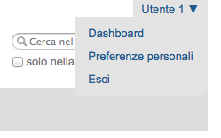
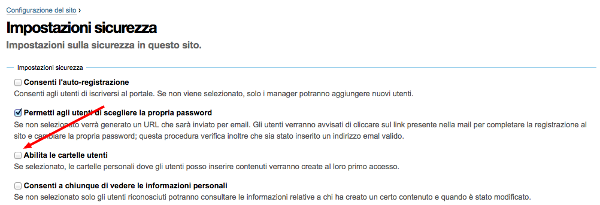

==========
Gli utenti
==========

Per quanto poco ci possa essere da dire sugli utenti, qualcosa vale la pena venga detto.

Un utente è un visitatore del sito che ha eseguito l'autenticazione, che possiede quindi un account
per accedere al sito.

In alcuni siti, dove è abilitata l'autoregistrazione degli utenti, chiunque può diventare utente
del sito.

Ogni utente del sito ha (di solito) il **ruolo Collaboratore** (**Member**).

Ci possono essere eccezioni?
Sì, un esempio molto comune è legato alle basi dati di utenti che non siano quella predefinita di
Plone (**plugin PAS** che forniscono altri basi dati utente).
La base dati LDAP più comune in Plone permette di configurare quali ruoli assegnare agli utenti
che si autenticano attraverso quel sistema.
In questo caso *Member* è solo il valore predefinito, ma sarebbe possibile fornire da subito altri
ruoli o non fornire nemmeno *Member*.

Che poteri ha un utente?
========================

Ci si potrebbe aspettare che il possedere un account in un sito Plone fornisca qualche tipo di
potere, ma questo *non è scontato*.

L'utente autenticato ha di certo (a meno di personalizzazioni poco comuni) una differenza
nell'interfaccia grafica del sito: compare il suo nome e l'accesso alle proprie preferenze
personali.

   *Il menù degli strumenti personali, espanso*

Per il resto (e nella versione attuale di Plone questo è vero di partenza) un utente del sito non
ha di partenza nessun altro potere.

L'utente inizia ad acquisire poteri nel momento in cui gli vengono assegnati dei ruoli
(direttamente, o tramite un gruppo).

Le cartelle personali
---------------------

In alcuni siti l'amministratore potrebbe aver abilitato l'uso delle **cartelle personali** degli
utenti, una speciale posizione del sito da considerarsi come la "casa" dell'utente (un po' come
la directory "home" comune in tutti i sistemi operativi odierni).

Questa impostazione ad oggi è disattivata nelle impostazioni predefinite ma può ancora essere
attivata dalle *impostazioni di sicurezza* del sito.

   *Come abilitate le cartelle personali degli utenti*

Che cosa può fare un utente comune nella propria cartella personale? Come ripeterò molto spesso
nel resto del libro: dipende.
L'unica cosa che succede sempre è che l'utente ha il ruolo di  **Possessore** (**Owner**) della
cartella e quindi acquisisce tutti i poteri del ruolo.

In una installazione base questo significa che l'utente è in grado di creare qualunque contenuto
egli voglia all'interno della propria cartella e, con i workflow che oggi sono predefiniti in
Plone, pubblicare i contenuti.

C'è sono vari motivi per cui questa sezione è ora disabilitata di base:

* si evita l'inutile creazione di cartelle (nei siti dove queste non sono in realtà mai usate)
* si evita che l'utente "salti" il workflow del sito e il sistema di revisione.

Il secondo punto è il più importante.
Nella mia esperienza (soprattutto con le vecchie versioni di Plone, precedenti alla 3, dove
questa impostazione era di base abilitata e ci si dimenticata di disattivarla) questa impostazione
provocava vari problemi.

Quando si disegna un sito con un workflow per ospitare una redazione molto complessa, si passa
diverso  tempo a disegnare una struttura del sito più o meno complessa, dove utenti e gruppi
abbiano compiti ben definiti.
Ad esempio: l'ipotetico "Ufficio 5" può avere una sua cartella e si vuole che gli utenti
scrivano lì dentro i contenuti relativi all'ufficio.

Molto spesso gli utenti trovano la strada più semplice: si accorgono di avere una cartella
personale dove possono scrivere i propri documenti... e lì scrivono.
Al termine del lavoro di solito viene chiesto agli amministratori di spostare i contenuti altrove.
In questo modo non c'è bisogno di imparare come funziona il workflow del sito o dove si trova la
propria area di lavoro.

La cartella personale è una bella funzionalità che va valutata e che può tornare utile, ma di
solito va presa in considerazione assieme ad una modifica dei workflow e della sicurezza del sito.

L'utente anonimo
================

Anche *il visitatore anonimo è un utente* e che possiede un ruolo speciale: **Anonimo**
(**Anonymous**). L'unica differenza con un utente autenticato è che non ha link agli strumenti
personali o un'area dove salvare le proprie preferenze, e che non identifica un singolo visitatore
ma una intera schiera di visitatori.

Sia che stiate realizzando una sito pubblico o una intranet, *questo utente va previsto*.

In un **sito pubblico** l'utente anonimo è quello che genera la maggior parte del traffico (i bot e
crawler dei motori di ricerca sono utenti anonimi). Va capito cosa e cosa non possono vedere, e
la sicurezza del sito deve essere calibrata su questa idea.

Per **una intranet** le cose possono sembrare più semplici e in certi contesti lo sono, ma non
ignorate il problema.
Ho visto un paio di casi dove il fatto che una intranet non sia accessibile al pubblico lasciava
pensare di essere al sicuro, per poi accorgersi che una qualunque persona in grado di collegare il
proprio computer alla rete dell'azienda o dell'ente potesse poi accedere a documenti importanti.

In altri casi ho visto come l'obbligo di autenticazione di una intranet venisse ottenuto
limitandosi a rendere privata la home page del sito.
Ci si accorgeva poi col tempo che un utente fosse in grado si saltare la home page e accedere
direttamente ad altre pagine (ad esempio: la pagina di ricerca di Plone), fosse in grado di vedere
documenti che si credevano segreti.

.. note::

   Il "*workflow intranet*" fornito da Plone non è ottimale! 

In questi casi la ricerca di Plone può darvi da subito un'idea della situazione (ma non basta).

